# Company Information

NESCO is a domestically managed food industry company founded in 2016
and headquartered in Ankara, Türkiye, that uses an innovative production
strategy for food and beverage items. The company's four brands are
Foopaco (food and beverage packaging solutions), Kakui (flavored sweet
nuts), The BobaCo (bubble tea products), and TeaCo (artisan tea blends).
From raw material sourcing and product development to production,
worldwide sales, and distribution, NESCO handles all aspects of its
business in-house, which allows it to control product quality and
respond flexibly to customer needs. It supplies more than 3,500
companies in Turkey and exports to over 30 countries, serving both
domestic HORECA and international B2B customers.\
The production line of NESCO's tea brand, TeaCo, includes artisan tea
blends made with quality tea leaves that are obtained from eight
different nations across the globe. Its fully cotton, plastic-free tea
bags and handcrafted filling processes set it apart with its sustainable
production methods, emphasizing product quality and consumer health.
TeaCo products are offered in different formats to both HORECA customers
(cafés, restaurants, hotels) and retail consumers, positioning the brand
as NESCO's main player in the specialty tea category. [@Hakkimizda]\
The company's fastest-growing brand, BobaCo, was among the first to
manufacture bubble tea on an industrial scale in Turkey. With 25
distinct popping boba flavors, its product portfolio also includes
tapioca pearls, concentrated tea bases, powdered drink mixes, and
popping boba. These products are mainly supplied under a B2B model to
cafés, coffee chains, restaurants, hotels, and beverage brands, while
some formats are also offered in retail packaging. The expansion of the
bubble tea market in Turkey has been mainly supported by BobaCo's
domestic production capacity. Facilities with worldwide quality and
safety certifications, including VEGAN, ISO 9001, and FDA, as well as
other international food safety schemes, create its goods and enable the
company to access export markets. With its investments in
future-oriented food and beverage technology, NESCO, which places a high
priority on reliability, quality, and product diversity in its
manufacturing processes, continues to become a significant producer in
domestic and foreign markets. Nesco also encourages an inclusive
employment culture with a notably high share of women in its workforce.
 [@BobaCo]\

# System Analysis and Project Definition

## System Analysis

The BobaCo production system manufactures four products: (i) Plastic
Tubs of bucketed boba for restaurants and other venues (mainly for the
domestic market), (ii) Semi-Finished Boba in Tubs, used as an input in
the production of retail products, (iii) Cup Bubble Tea (ready-to-drink
in cup format), and (iv) Can Bubble Tea (ready-to-drink in can format).
All of these products are sold under a B2B model, primarily targeting
HORECA customers such as cafes, restaurants, and beverage chains.
Production is organized on two lines. The first line is used for Plastic
Tubs and Semi-Finished Boba, which follow the same production processes
and look identical; however, differences in their ingredient
formulations make them distinct products. The second line is used to
produce Cup and Can Bubble Tea. Due to pasteurization line constraints,
Cup and Can products cannot be produced on the same day. Furthermore,
for both lines, once a line is set up for a specific product, it cannot
be switched to another product on the same day; therefore, each line can
process at most one product per day.\
A critical structural feature of the system is that the Plastic Tub Boba
is sold directly as a finished product, whereas the Semi- Finished Boba
in Tub is used only as an input in the production of Cup and Can Bubble
Tea. Popping boba amount used for retail products is 60g. The company
needs to have enough raw material in order to produce goods. Maximum
lead time of raw materials is 75 days. Raw materials have different
minimum order quantities in terms of numbers and kilograms. The boba
products have a shelf life of approximately 12--18 months, allowing the
company to carry inventory for multiple months if needed. In the
previous NESCO facility, however, storage capacity was very limited, so
almost no inventory could be built ahead of demand. With the transition
to the new facility, sufficient storage space is now available, enabling
the company to hold inventory for future periods and to utilize this
long shelf life more effectively.\
The figure [1](#fig:chart){reference-type="ref" reference="fig:chart"}
below demonstrates the production process flow of popping boba:

<figure id="fig:chart" data-latex-placement="h!">
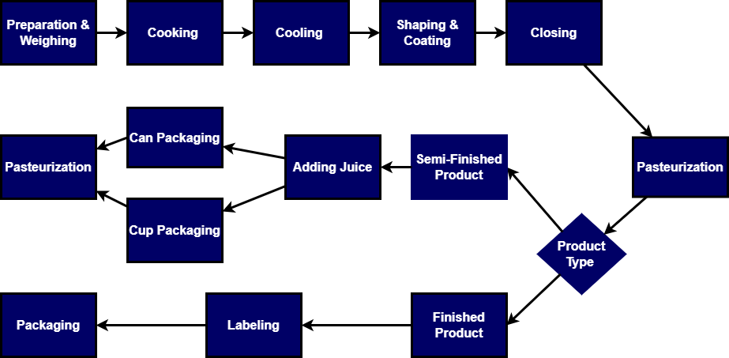
<figcaption>Production workflow of popping boba in the
facility</figcaption>
</figure>

## Problem Definition

The company faced high demand during the summer season in previous
years. However, it was challenging to meet this demand due to limited
production capacity. The lack of storage space prevented the company
from building inventory ahead, although product shelf life would allow
stock to be carried over multiple months. Now that the company has
transitioned to another facility, storage limitations have eased, making
it essential to develop a production and inventory planning model that
uses line capacity and advanced production to meet peak-season demand.
The key challenge is to balance holding and backlogging costs in terms
of raw materials and produced goods. The company prepares its production
plan and schedule semi-manually by evaluating market insights, past
experiences, and previous demand data. Since demand levels, particularly
in the domestic market, fluctuate seasonally and cannot always be
predicted precisely, a reliable and mathematically based decision
support system is needed to adjust the company's production planning
accordingly. The objective of this decision support system is to
generate a production plan that determines the optimal production and
stocking levels of different product types, minimizing holding and
backlogging costs during the high-demand season while satisfying system
requirements.

# Review of Resources

The production--inventory planning problem in this project falls under
the category of deterministic, capacity-constrained, multi-period
planning problems. Classical models, such as aggregate production
planning, deterministic inventory control, and lot-sizing, provide the
basic structure for decisions on production timing, capacity allocation,
and inventory levels. These models are systematically presented in the
textbook *Production and Operations Analysis* by  [@nahmias2015poa],
which introduces trade-offs between setup, production, inventory, and
backlog in deterministic settings.\
The capacitated lot-sizing problem (CLSP) is a central model within this
class of problems. In CLSP, multiple items are planned over a finite
horizon under capacity constraints to minimize total setup, production,
and inventory costs.  [@karimi2003cls] review single-level CLSP variants
and solution approaches, and emphasize that lot sizing is both one of
the most important and one of the most challenging problems in
production planning due to its combinatorial nature and NP-hardness. In
many practical systems, however, some items are used as components of
others, leading to multi-level capacitated lot-sizing problems (MLCLSP).
 [@maes1991mlcls] analyze MLCLSP with bill-of-materials structures and
show that these problems inherit and amplify the complexity of CLSP,
especially when capacity limits appear on several levels.\
A common extension in deterministic lot-sizing models is to allow
backlogging, where unmet demand is carried forward and fulfilled later
(typically modeled via backlog variables and penalty terms or service
constraints), as discussed by [@PochetWolsey1988]. These CLSP/MLCLSP
models provide a conceptual benchmark for our setting: a small,
multi-product, multi-period system with limited line capacities and at
least one intermediate item consumed by multiple finished products
naturally fits into the MLCLSP framework. At the same time, the
complexity results of  [@karimi2003cls] and  [@maes1991mlcls] indicate
that solving a single, fully integrated MLCLSP MIP over realistic
horizons is rarely practical for routine planning, which motivates the
use of decomposed or approximate approaches.\
A significant line of research addressing this challenge is hierarchical
production planning (HPP).  [@bitran1982hpp] formalize HPP as a
two-stage system: an upper-level aggregate model determines medium-term
production and inventory levels, whereas a lower-level model
disaggregates these decisions into detailed schedules for specific
products and resources. They demonstrate that such hierarchical
decompositions can achieve costs comparable to those of monolithic
models, while substantially reducing the problem size and data
requirements.  [@liberatore1985hpp] demonstrate an implemented HPP
system for American Olean Tile, where an annual aggregate plan is linked
to short-term mixed-integer scheduling; their case study illustrates how
hierarchical models can be embedded in practice and used repeatedly
within a firm's planning process.\
A related area of research focuses on rolling-horizon planning.
 [@sahin2013rolling] review various rolling-horizon schemes in supply
chains, examining how factors such as planning horizon, replanning
frequency, and freezing rules can impact both cost performance and
schedule stability. They conclude that rolling horizons are an effective
method for maintaining responsiveness in multi-period planning problems,
as long as near-term decisions are stabilized to prevent excessive
fluctuations. These insights are particularly relevant in situations
where plans need to be frequently updated based on revised demand
information.\
The two-stage stochastic reformulation in this project is introduced to
represent the effect of demand uncertainty on production--inventory
decisions within a structured planning framework. Two-stage stochastic
programming is a common methodological framework for decision problems
under uncertainty, where so-called "here-and-now" decisions made before
uncertainty resolution are distinguished from "recourse" decisions made
after uncertainty realization. Following the scenario-based modeling
framework presented by Birge and Louveaux [@BirgeLouveaux2011], the
deterministic long-term production--inventory model is generalized to a
stochastic model by considering a finite set of scenarios $\Omega$ for
uncertain demand. The deterministic demand parameter $d_{it}$ is
replaced with a scenario-dependent demand parameter $d_{it\omega}$,
while first-stage decisions that need to be made before uncertainty
resolution remain scenario-independent. Production, inventory, and
backlog decisions in subsequent periods are represented as
scenario-dependent recourse variables (e.g., $P_{it\omega}$,
$I_{it\omega}$, $B_{it\omega}$). In line with the standard two-stage
modeling framework, the objective function is modified to minimize the
expected total cost, where the cost of holding and backlogging inventory
is aggregated over all scenarios (e.g., assuming equal probability by
averaging over $|\Omega|$). Operational constraints, such as production
capacity constraints, flow-balance constraints, and storage capacity
constraints, are imposed for each scenario to guarantee feasibility.\
Overall, this literature gives us a clear way to position our work. CLSP
and MLCLSP studies describe the "fully integrated" benchmark for
multi-product, multi-period planning with capacity limits and
intermediate items, and they also explain why such models quickly become
difficult to solve at realistic scale. The lot-sizing literature also
supports common extensions such as backlogging, where unmet demand is
carried forward and fulfilled later, which aligns with our setting where
orders can be delayed under a FIFO policy within a limited waiting
window (about 12 days). Hierarchical production planning research shows
a common way to handle this complexity by separating planning into an
aggregate level and a detailed scheduling level, while keeping the two
consistent. Rolling-horizon planning complements this by showing how
plans can be updated regularly over a moving time window as demand
information changes, without constantly destabilizing the near-term
schedule. Finally, two-stage stochastic programming provides a
principled way to incorporate demand uncertainty into the aggregate
(long-term) level by making early decisions before uncertainty is
revealed and allowing recourse actions afterward [@BirgeLouveaux2011].
Taken together, these ideas support framing our problem within the
MLCLSP family, and motivate using a hierarchical structure with rolling
updates and a two-stage long-term model to produce plans that are both
tractable and usable in practice.\

# Proposed Solution Strategy

## General Approach

In order to provide a solution to the company's challenge to satisfy
demand in high-demand seasons, a production plan optimization tool with
a mathematical model is required. For this purpose, an optimization
model that represents the company's production system for a full year
with daily time periods had been created. Also, this model considers the
operational limits of the factory, such as line-based product
separation, ensuring that the proposed production and inventory plans
are feasible for the real system.

The main aim of this model is to plan daily production for each line and
make daily inventory decisions for all products so that backlogs stay
low without creating unnecessary inventory. Backlogging is allowed to
preserve feasibility during temporary capacity or material shortages.
However, the company does not consider backlogs within a two-week window
as a critical issue, whereas delays beyond two weeks become problematic
because they may lead to order cancellations. Therefore, the planning
approach is designed to keep backlogs from exceeding two weeks whenever
possible, while still balancing this service consideration against
inventory build-up, especially under seasonal demand.

However, when this model is applied to the full year with daily detail,
the problem size becomes large and difficult to solve within practical
time limits. For this reason, we use a heuristic solution approach based
on dividing this model into two models, namely a long-term and a
short-term model. This method aims to balance solution quality and
computational efficiency by generating feasible production plans that
capture the system's key constraints and objectives.

## Critical Assumptions

There were several critical assumptions made in order to create the
models effectively and efficiently:

- Semi-finished Boba and Tub Boba are two different products.

- Backlogging is allowed in the system.

- Production lines can only produce one type of product in a day.

- Backlogs within two weeks are treated as non-critical, while delays
  beyond two weeks are considered problematic and more costly due to
  potential order cancellations.

## Mathematical Model

### Major Constraints

Production lines in the factory are not able to switch between products
in a day. If a product is assigned to its corresponding production line,
it should use it for all day. There are two production lines; the first
line serves to produce boba for both Plastic Tub and Semi-Finished Boba
products. Second line serves to Cup Bubble Tea and Can Bubble Tea
products. Total production is limited by the workdays in that period
without overtime usage. Since Semi-Finished Boba product is not directly
demanded, it is used for Cup and Can products. Semi-finished Boba can
also be stored for future usage of it. Other products that are not
Semi-Finished Boba products are directly demanded from end customers and
can be stored. There is a limited inventory area in the factory, which
implies stored products' sum of usage area cannot exceed that area.

### Objectives

The objective of the mathematical model is to find a long-term inventory
and production strategy by minimizing holding and backlog costs to cover
the high-demand season with an optimal inventory level. Corresponding
costs for backlogging are relatively higher than inventory cost, so the
objective function is generated to mainly find a production plan while
minimizing the sum of those two costs.

### Formulation of the Mathematical Model

  **Sets**   **Definition**
  ---------- --------------------------------------------------------------------
  $K_1$      Set of Plastic Tub and Semi-Finished Boba Products ($K_1=\{1,2\}$)
  $K_2$      Set of Cup Bubble Tea and Can Bubble Tea Products ($K_2=\{3,4\}$)
  $T$        Set of Days in Period
  $S$        Set of Raw Materials
  $M$        Set of machines on Line 1 ($M=\{1,2,3\}$)
  $M_3$      Set of machines for product 3 on Line 2 ($M_3=\{1,2\}$)

  : Sets of Mathematical Model

  **Parameters**   **Definition**
  ---------------- -----------------------------------------------------------------------------------------------
  $b_i$            Daily unit backlog cost of product $i$
  $b_i^{12}$       Daily unit backlog cost of product $i$ whose due date has exceeded at least 12 days
  $n_{is}$         Number of raw material $s$ needed for one unit of product $i$
  $LT_s$           Lead time of raw material $s$
  $\kappa_m$       Daily capacity of machine $m\in M$ on Line 1 (full capacity if selected)
  $\kappa^{3}_m$   Daily capacity of machine $m\in M_3$ when producing product 3 on Line 2
  $\kappa^{4}$     Daily capacity of Line 2 when producing product 4 (single machine)
  $u_{23}$         Amount of product $2$ needed to produce product $3$
  $u_{24}$         Amount of product $2$ needed to produce product $4$
  $d_{i,t}$        Customer demand of product $i$ at day $t$
  $h_i$            Unit holding cost of product $i$
  $h_s^{r}$        Unit holding cost of raw material $s$ (used with weekly RM inventory)
  $I^{max}$        Maximum inventory area
  $v_i$            Inventory area usage of unit product $i$
  $I_r^{max}$      Maximum raw material inventory area
  $v_s$            Inventory area usage of unit raw material $s$
  $w_{i,t}$        Sum of the demand obtained for product $i$ from period $t-12$ to $t$ (Demand of last 12 days)
  $moq_s$          Minimum order quantity for raw material $s$
  $I_{i,0}$        Initial inventory of product $i$ at the start of day 1
  $B_{i,0}$        Initial backlog of product $i$ at the start of day 1
  $I^{r}_{s,0}$    Initial raw material inventory of $s$ at the start of day 1

  : Parameters of Mathematical Model

  **Variables**    **Definition**
  ---------------- ---------------------------------------------------------------------------------------
  $P_{i,t}$        Number of unit $i$ produced at day $t$
  $I_{i,t}$        Number of unit product $i$ in inventory at day $t$
  $I_{s,t}^r$      Number of raw material $s$ in inventory at the end of day $t$
  $R_{s,t}$        Number of raw material $s$ ordered at day $t$
  $Z_{s,t}$        $1$ if an order is placed for raw material $s$ at day $t$, $0$ otherwise
  $B_{i,t}$        Backlog amount of product $i$ at day $t$
  $B_{i,t}^{12}$   Backlog amount of product $i$ at day $t$ whose due date has exceeded at least 12 days
  $X_{m,1,t}$      $1$ if machine $m\in M$ produces product 1 at day $t$, $0$ otherwise
  $X_{m,2,t}$      $1$ if machine $m\in M$ produces product 2 at day $t$, $0$ otherwise
  $X_{m,3,t}$      $1$ if machine $m\in M_3$ produces product 3 at day $t$, $0$ otherwise
  $X_{4,t}$        $1$ if Line 2 produces product 4 at day $t$, $0$ otherwise

  : Decision Variables of Mathematical Model

$$\begin{alignat}
{4}
&\min && \sum_{t\in T}\sum_{i \in K_1 \cup K_2}\bigl(b_iB_{i,t}+b_i^{12}B_{i,t}^{12}+h_iI_{i,t}\bigr)
+ \sum_{t\in T}\sum_{s\in S}h^r_s I^r_{s,t} & \tag{1} \\[4pt]
&\text{s.t.} \quad
&& X_{m,1,t}+X_{m,2,t}\leq 1 && \hspace{-2cm} \forall m\in M,\forall t\in T  &\tag{2} \\[4pt]
&&& X_{m,3,t}\leq 1-X_{4,t} && \hspace{-2cm} \forall m\in M_3,\forall t\in T  &\tag{3} \\[4pt]
&&& P_{1,t}= \sum_{m\in M}\kappa_m X_{m,1,t} && \hspace{-2cm} \forall t\in T &&\tag{4}\\[4pt]
&&& P_{2,t}= \sum_{m\in M}\kappa_m X_{m,2,t} && \hspace{-2cm}\forall t\in T &&\tag{5}\\[4pt]
&&& P_{3,t}= \sum_{m\in M_3}\kappa^{3}_m X_{m,3,t} &&\hspace{-2cm} \forall t\in T &&\tag{6}\\[4pt]
&&& P_{4,t}= \kappa^{4} X_{4,t} &&\hspace{-2cm} \forall t\in T &&\tag{7}\\[4pt]
&&& I_{2,t-1}+P_{2,(t-1)}-\sum_{i\in K_2} u_{2i}P_{i,t} = I_{2,t} \quad && \hspace{-2cm} \forall t\in T &&\tag{8}\\[4pt]
&&& I_{i,t-1}+P_{i,t} - (d_{i,t}+B_{i,t-1})+B_{i,t} = I_{i,t}
&& \hspace{-2cm} \forall t\in T, \forall i\in K\backslash \{2\}  &&\tag{9}\\[4pt]
&&& I_{s,t}^{r}
= I_{s,(t-1)}^{r} + R_{s,(t-LT_s)}
-\hspace{-0.3cm}\sum_{i \in K_1 \cup K_2}\hspace{-0.3cm} n_{is}  P_{i,t}
&& \hspace{-2cm} \forall s\in S,\forall t\in T &&\tag{10}\\[4pt]
&&& R_{s,t} \ge moq_s \cdot Z_{s,t}&& \hspace{-2cm} \forall s\in S,\forall t\in T &&\tag{11}\\[4pt]
&&& I^{max} \geq \sum_{i \in K_1 \cup K_2}v_iI_{i,t} && \hspace{-2cm} \forall t\in T &&\tag{12}\\[4pt]
&&& I_r^{max} \geq \sum_{s\in S}v_sI_{s,t}^{r}&& \hspace{-2cm} \forall t\in T &&\tag{13}\\[4pt]
&&& B_{i,t}^{12} \geq B_{i,t}-w_{i,t}&& \hspace{-2cm} \forall i\in K_1 \cup K_2,\forall t\in T &&\tag{14}\\[4pt]
&&& X_{m,1,t}\in\{0,1\} ,X_{m,2,t}\in\{0,1\} &&\hspace{-2cm}  \forall m\in M, \forall t\in T &&\tag{15}\\[4pt]
&&& X_{m,3,t}\in\{0,1\},\ X_{4,t}\in\{0,1\} &&\hspace{-2cm} \forall m\in M_3,\forall t\in T &&\tag{16}\\[4pt]
&&& Z_{s,t}\in\{0,1\} &&\hspace{-2cm} \forall s\in S, \forall t\in T &&\tag{17}\\[4pt]
&&& P_{i,t},I_{i,t},B_{i,t},B_{i,t}^{12},I_{s}^r,R_{s}\geq 0
&& \hspace{-2cm} \forall i\in K,\forall t\in T, &&\tag{18}
\end{alignat}$$

- Objective Function (1): Objective function of the Mathematical Model
  minimizes total holding and backlog cost.

- Constraints (2),(3): Enforces the updated production line structure.

- Constraints (4)-(7): Full-capacity production definitions based on
  machine selection binaries.

- Constraint (8): Inventory balance constraint of Semi-Finished Boba
  product.

- Constraint (9): Inventory balance constraint of finished products.

- Constraint (10): Weekly inventory balance constraint of raw materials
  (Monday orders by definition).

- Constraint (11): MOQ and order activation constraints.

- Constraints (12),(13): Inventory area limits for products and raw
  materials.

- Constraints (14): Defines the portion of backlog older than 12 days.

- Constraints (15)-(18): Domain constraints for decision variables.

## Heuristic Approach

In this heuristic approach, we divide the original model into two linked
models: a long-term model and a short-term model. The short-term model
is essentially the same mathematical model as the original one, but it
is solved only for a 48-day horizon, which corresponds to the number of
working days in 8 weeks. In this model, we still decide the daily
production and inventory levels for each product on each line, and we
add two extra parameters to incorporate long-term inventory decisions.
These additional parameters come from the long-term model.

The long-term model works with monthly time periods over the whole year
and shows how much we plan to produce and keep in inventory at an
aggregate level. To account for demand uncertainty in this planning
layer, the long-term model is formulated as a two-stage stochastic
program. The first stage covers the initial months (t = 1,2), where
decisions are made before uncertainty is revealed. The second stage
covers the remaining months (t = 3,...,12), where demand is represented
through scenarios $\omega \in \Omega$ and scenario-dependent recourse
decisions are optimized. The objective combines the first-stage costs
with the expected second-stage costs across scenarios, and the system
state at the end of t = 2 is carried into the scenario-based stage to
ensure consistency.

The inventory decisions obtained from this long-term model are then used
as parameters in the short-term model and determine the long-term
inventory levels that the short-term model should reach. Both models are
run in a rolling-horizon manner: the long-term model is solved monthly
with the necessary parameter updates, and the short-term model is
repeatedly solved weekly over a 2-month time period (48 workdays). The
combination of the two models provides a detailed short-term production
schedule while still considering future demand and inventory costs.
Figure [2](#fig:heur){reference-type="ref" reference="fig:heur"}
demonstrates a chart to see the two models logic visually:

<figure id="fig:heur" data-latex-placement="h!">
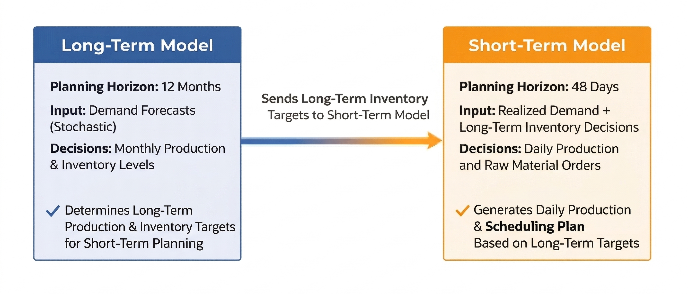
<figcaption>Long-term and short-term models</figcaption>
</figure>

### Deterministic Long-Term Aggregate Production Planning Model

This long-term model covers similar constraints to the mathematical
model, with the exception of strict daily production capacity. Moreover,
this model's constraints cover monthly decisions and do not consider raw
material existence. The objective of the long-term model is to find a
less costly monthly long-term inventory strategy by minimizing holding
and backlog costs to cover the high-demand season with an optimal
inventory level.

  **Sets**   **Definition**
  ---------- ----------------------------------------------------
  $K_1$      Set of Plastic Tub and Semi-Finished Boba Products
  $K_2$      Set of Cup Bubble Tea and Can Bubble Tea Products
  $T$        Set of Planning Periods ($T=\{1,\dots,12\}$)
  $J$        Set of Production Lines

  : Sets of Deterministic Long-Term Model

  **Parameters**   **Definition**
  ---------------- ----------------------------------------------------------------------
  $d_{i,t}$        Demand of product $i$ in period $t \in \{1,2\}$
  $a_t$            Number of workdays in period $t$
  $b_i$            Backlog cost for product $i$
  $c_1$            Daily unit capacity of production line 1
  $c_{2,i}$        Daily unit capacity of production line 2 for product $i$
  $I^{max}$        Maximum storage area
  $r_i$            Unit usage area of product $i$
  $u_{i2}$         Number of product 2 used in the production of product $i\in \{3,4\}$
  $h_i$            Holding cost of product $i$ for unit period

  : Parameters of Deterministic Long-Term Model

  **Variables**   **Definition**
  --------------- ----------------------------------------------------------------------
  $P_{i,t}$       Production amount of product $i$ at period $t \in \{1,2\}$
  $I_{i,t}$       Inventory amount of product $i$ at the end of period $t \in \{1,2\}$
  $B_{i,t}$       Backlog amount of product $i$ at period $t \in \{1,2\}$

  : Decision Variables of Deterministic Long-Term Model

$$\begin{alignat}
{4}
&\min && \sum_{t=1}^{2}\sum_{i \in K_1 \cup K_2}\bigl(b_iB_{i,t}+h_iI_{i,t}\bigr)
&& \tag{1} \\[4pt]
&\text{s.t.} \quad
&& \sum_{i \in K_1}\frac{P_{i,t}}{c_1} \leq a_t  && \forall t\in \{1,2\} &&\tag{2}\\[4pt]
&&& \sum_{i \in K_2}\frac{P_{i,t}}{c_{2,i}}  \leq a_t  && \forall t\in \{1,2\} &&\tag{3}\\[4pt]
&&& I_{2,t-1}+P_{2,t}-\sum_{i\in K_2}u_{i2}\,P_{i,t} = I_{2,t} \quad && \forall t\in \{1,2\} &&\tag{4}\\[4pt]
&&& I_{i,t-1}+P_{i,t} - (d_{i,t}+B_{i,t-1})+B_{i,t} = I_{i,t}
&&  &&\tag{5}\\[4pt]
&&& && \hspace{-2cm} \forall t\in \{1,2\},\forall i\in (K_1 \cup K_2)\backslash \{2\} &&\tag{5}\\
&&& I^{max} \geq \sum_{i=1}^{4} r_i I_{i,t} && \forall t\in \{1,2\} &&\tag{6}\\[4pt]
&&& P_{i,t},I_{i,t},B_{i,t} \geq 0
&& \forall i\in K_1 \cup K_2,\forall t\in T
&&\tag{7}
\end{alignat}$$

- **Objective Function (1):** The objective function of the
  deterministic long-term model minimizes the total holding and backlog
  costs over the deterministic planning horizon.

- **Constraints (2)-(3):** These constraints represent the production
  capacity limitations of the two production lines. Constraint (2)
  restricts the total production assigned to line 1 by the number of
  available workdays in period $t$, while Constraint (3) imposes the
  same limitation for line 2.

- **Constraint (4):** This constraint is the inventory balance equation
  for Semi-Finished Boba (product 2). It states that the ending
  inventory of product 2 equals the beginning inventory plus production
  minus the quantity used as an input in the production of products in
  set $K_2$.

- **Constraint (5):** This is the inventory--backlog balance constraint.
  It ensures that, for each product and period, available inventory and
  production are allocated between demand fulfillment, backlog
  carryover, and ending inventory.

- **Constraint (6):** This constraint enforces the storage capacity
  limitation by ensuring that the total area occupied by end-of-period
  inventory does not exceed the maximum available storage area.

- **Constraint (7):** This constraint imposes non-negativity on the
  production, inventory, and backlog decision variables.

### Two-Stage Stochastic Long-Term Aggregate Production Planning Model

To include demand uncertainty in the solution approach, the long-term
model is formulated with a two-stage stochastic structure, where
decisions are fixed for the early months and then allowed to adapt
across demand scenarios for the rest of the year.

  **Sets**   **Definition**
  ---------- ----------------------------------------------------
  $K_1$      Set of Plastic Tub and Semi-Finished Boba Products
  $K_2$      Set of Cup Bubble Tea and Can Bubble Tea Products
  $T$        Set of Planning Periods ($T=\{1,\dots,12\}$)
  $J$        Set of Production Lines
  $\Omega$   Set of Scenarios

  : Sets of Long-Term Model

  **Parameters**     **Definition**
  ------------------ ----------------------------------------------------------------------------------
  $d_{i,t}$          Demand of product $i$ in period $t \in \{1,2\}$
  $d_{i,t,\omega}$   Demand of product $i$ in period $t \in \{3,4,\dots,12\}$ under scenario $\omega$
  $a_t$              Number of workdays in period $t$
  $b_i$              Backlog cost for product $i$
  $c_1$              Daily unit capacity of production line 1
  $c_{2,i}$          Daily unit capacity of production line 2 for product $i$
  $I^{max}$          Maximum storage area
  $r_i$              Unit usage area of product $i$
  $u_{i2}$           Number of product 2 used in the production of product $i\in \{3,4\}$
  $h_i$              Holding cost of product $i$ for unit period

  : Parameters of Long-Term Model

  **Variables**      **Definition**
  ------------------ ----------------------------------------------------------------------------------
  $P_{i,t}$          Production amount of product $i$ at period $t \in \{1,2\}$
  $I_{i,t}$          Inventory amount of product $i$ at the end of period $t \in \{1,2\}$
  $B_{i,t}$          Backlog amount of product $i$ at period $t \in \{1,2\}$
  $P_{i,t,\omega}$   Production amount of product $i$ at period $t$ under scenario $\omega$
  $I_{i,t,\omega}$   Inventory amount of product $i$ at the end of period $t$ under scenario $\omega$
  $B_{i,t,\omega}$   Backlog amount of product $i$ at period $t$ under scenario $\omega$

  : Decision Variables of Long-Term Model

$$\begin{alignat}
{4}
&\min && \sum_{t=1}^{2}\sum_{K_1 \cup K_2}\bigl(b_iB_{i,t}+h_iI_{i,t}\bigr)
+ \sum_{\omega\in\Omega}\sum_{t=3}^{12}\sum_{i \in K_1 \cup K_2}{p_{\omega}}\bigl(b_iB_{i,t,\omega}+h_iI_{i,t,\omega}\bigr)
&& \tag{1} \\[4pt]
&\text{s.t.} \quad
&& \sum_{i \in K_1}\frac{P_{i,t}}{c_1} \leq a_t  && \hspace{-4cm} \forall t\in \{1,2\} &&\tag{2}\\[4pt]
&&& \sum_{i \in K_2}\frac{P_{i,t}}{c_{2,i}}  \leq a_t  &&\hspace{-4cm}  \forall t\in \{1,2\} &&\tag{3}\\[4pt]
&&& \sum_{i \in K_1}\frac{P_{i,t,\omega}}{c_1} \leq a_t  && \hspace{-4cm}\forall t\in \{3,12\},\forall \omega \in \Omega &&\tag{4}\\[4pt]
&&& \sum_{i \in K_2} \frac{P_{i,t,\omega}}{c_{2,i}} \leq a_t  && \hspace{-4cm}\forall t\in \{3,12\},\forall \omega \in \Omega &&\tag{5}\\[4pt]
&&& I_{2,t-1}+P_{2,t}-\sum_{i\in K_2}u_{i2}\,P_{i,t} = I_{2,t} \quad &&\hspace{-4cm} \forall t\in \{1,2\} &&\tag{6}\\[4pt]
&&& I_{2,2}+P_{2,3,\omega}-\sum_{i\in K_2}u_{i2}\,P_{i,3,\omega} = I_{2,3,\omega} \quad && \hspace{-4cm} \forall \omega \in \Omega &&\tag{7}\\[4pt]
&&& I_{2,t-1,\omega}+P_{2,t,\omega}-\sum_{i\in K_2}u_{i2}\,P_{i,t,\omega} = I_{2,t,\omega} \quad && \hspace{-4cm} \forall t\in \{4,\dots,12\} &&\tag{8}\\[4pt]
&&& I_{i,t-1}+P_{i,t} - (d_{i,t}+B_{i,t-1})+B_{i,t} = I_{i,t}
&&  &&\tag{9}\\[4pt]
&&& && \hspace{-6cm} \forall t\in \{1,2\},\forall i\in (K_1 \cup K_2)\backslash \{2\} &&\tag{9}\\[4pt]
&&& I_{i,2}+P_{i,3,\omega} - (d_{i,3,\omega}+B_{i,2})+B_{i,3,\omega} = I_{i,3,\omega}
&&  &&\tag{10}\\[4pt]
&&& && \hspace{-6cm} \forall \omega \in \Omega,\forall i\in (K_1 \cup K_2)\backslash \{2\}&&\tag{10}\\[4pt]
&&& I_{i,t-1,\omega}+P_{i,t,\omega} - (d_{i,t,\omega}+B_{i,t-1,\omega})+B_{i,t,\omega} = I_{i,t,\omega}
&& &&\tag{11}\\[4pt]
&&& && \hspace{-9cm} \forall t\in \{4,\dots,12\},\forall \omega \in \Omega,\forall i\in (K_1 \cup K_2)\backslash \{2\} &&\tag{11}\\[4pt]
&&& I^{max} \geq \sum_{i=1}^{4} r_i I_{i,t} && \hspace{-4cm}\forall t\in \{1,2\} &&\tag{12}\\[4pt]
&&& I^{max} \geq \sum_{i=1}^{4} r_i I_{i,t,\omega} && \hspace{-5cm}\forall t\in \{3,\dots,12\},\forall \omega\in\Omega &&\tag{13}\\[4pt]
&&& P_{i,t},I_{i,t},B_{i,t},P_{i,t,\omega},I_{i,t,\omega},B_{i,t,\omega} \geq 0
&&  &&\tag{14}\\
&&& && \hspace{-6cm}\forall i\in K_1 \cup K_2,\forall t\in T,\forall \omega \in \Omega &&\tag{14}
\end{alignat}$$

- Objective Function (1): Objective function of the long-term model
  minimizes total yearly holding and backlog costs.

- Constraints (2)-(5): Enforcing that the production amount doesn't
  exceed production capacity.

- Constraints (6)-(8): Inventory balance constraints of Semi-Finished
  Boba product (product 2).

- Constraints (9)-(11): Inventory balance constraints of finished
  products.

- Constraints (12)-(13): Ensures that total used inventory area doesn't
  exceed maximum inventory area.

- Constraint (14): Non-negativity constraint of decision variables.

### Scenario Generation for the Two-Stage Long-Term Model {#sec:scenario_generation}

The decision support system performs production planning over a one-year
horizon while treating the first two months of demand as known inputs.
The purpose is to represent demand uncertainty in a controlled way and
to avoid relying on a single forecast path. We do not build an internal
forecasting model because demand is highly uncertain and reliable
historical demand data are not available. Instead, the system receives a
user-provided forecast vector and transforms it into a set of demand
scenarios for the two-stage stochastic programming formulation.
Therefore, the forecast is treated as the mean demand level, and
uncertainty is introduced through scenario sampling around this mean.

Let $f_{1},\ldots,f_{10}$ denote the company-provided forecasts for the
uncertain months, corresponding to months $3$ to $12$ of the planning
horizon, and let $s_{1},\ldots,s_{10}$ denote the monthly deviation
rates specified by the company. Each $s_t$ is interpreted as the maximum
relative deviation around the forecast mean for month $t$. The objective
of the scenario generator is to create $N$ plausible $10$-month demand
paths, each representing one realization of uncertainty in the
second-stage horizon, while guaranteeing that every monthly value stays
within the uncertainty band defined by the company.

For each month $t \in \{1,\ldots,10\}$, lower and upper bounds are
defined as $$\begin{align}
L_t &= f_t(1 - s_t), \\
U_t &= f_t(1 + s_t).
\end{align}$$

A demand scenario is generated by sampling uniformly within these
bounds: $$\begin{align}
D_{k,t} &= L_t + u_{k,t}\bigl(U_t - L_t\bigr), \qquad u_{k,t} \sim \mathrm{Uniform}(0,1).
\end{align}$$

By construction, $D_{k,t} \in [L_t, U_t]$ for all scenarios $k$ and
months $t$. For integration, months $1$--$2$ are treated as
deterministic inputs and remain fixed, while the scenario generator is
applied only to months $3$--$12$. Each generated vector
$(D_{k,1},\ldots,D_{k,10})$ is then used as the scenario-specific demand
realization in the stochastic formulation by indexing uncertain-month
demand with $k$. All demand-driven constraints and cost terms in the
second-stage horizon are evaluated separately for each scenario using
its own $D_{k,t}$ values, and the overall objective aggregates these
scenario outcomes using scenario probabilities. When no additional
information is available, equal probabilities are assigned, so
$p_k = 1/N$, and the model minimizes the expected total cost across the
scenario set.

### Short-Term Production Planning Model

This model is a shortened version of the Main Mathematical Model, with
the additional two parameters introduced. These new parameters are the
necessary inventory decisions obtained from the Long-Term Model. The
model tries to satisfy these inventory decisions until the given days of
these parameters.

The objective of the short-term model is to satisfy both yearly
production decisions that came from the long-term model and the realized
demand in an 8-week period. In order to generate an accurate and
efficient production plan, a mixed integer linear planning model is
created. This model aims to get the necessary inventory decisions from
the long-term model and find a near-optimal production schedule to
satisfy them.\

  **Sets**   **Definition**
  ---------- --------------------------------------------------------------------
  $K_1$      Set of Plastic Tub and Semi-Finished Boba Products ($K_1=\{1,2\}$)
  $K_2$      Set of Cup Bubble Tea and Can Bubble Tea Products ($K_2=\{3,4\}$)
  $T$        Set of Days in Period
  $S$        Set of Raw Materials
  $M$        Set of machines on Line 1 ($M=\{1,2,3\}$)
  $M_3$      Set of machines for product 3 on Line 2 ($M_3=\{1,2\}$)

  : Sets of Short-Term Model

  **Parameters**            **Definition**
  ------------------------- -----------------------------------------------------------------------------------------------
  $b_i$                     Daily unit backlog cost of product $i$
  $b_i^{12}$                Daily unit backlog cost of product $i$ whose due date has exceeded at least 12 days
  $n_{is}$                  Number of raw material $s$ needed for one unit of product $i$
  $LT_s$                    Lead time of raw material $s$
  $\kappa_m$                Daily capacity of machine $m\in M$ on Line 1 (full capacity if selected)
  $\kappa^{3}_m$            Daily capacity of machine $m\in M_3$ when producing product 3 on Line 2
  $\kappa^{4}$              Daily capacity of Line 2 when producing product 4 (single machine)
  $u_{23}$                  Amount of product $2$ needed to produce product $3$
  $u_{24}$                  Amount of product $2$ needed to produce product $4$
  $d_{i,t}$                 Customer demand of product $i$ at day $t$
  $d^D_{i,1} , d^D_{i,2}$   Long-term inventory decision parameters
  $h_i$                     Unit holding cost of product $i$
  $h_s^{r}$                 Unit holding cost of raw material $s$ (used with weekly RM inventory)
  $I^{max}$                 Maximum inventory area
  $v_i$                     Inventory area usage of unit product $i$
  $I_r^{max}$               Maximum raw material inventory area
  $v_s$                     Inventory area usage of unit raw material $s$
  $w_{i,t}$                 Sum of the demand obtained for product $i$ from period $t-12$ to $t$ (Demand of last 12 days)
  $moq_s$                   Minimum order quantity for raw material $s$
  $I_{i,0}$                 Initial inventory of product $i$ at the start of day 1
  $B_{i,0}$                 Initial backlog of product $i$ at the start of day 1
  $I^{r}_{s,0}$             Initial raw material inventory of $s$ at the start of day 1

  : Parameters of Short-Term Model

  **Variables**    **Definition**
  ---------------- ---------------------------------------------------------------------------------------
  $P_{i,t}$        Number of unit $i$ produced at day $t$
  $I_{i,t}$        Number of unit product $i$ in inventory at day $t$
  $I_{s,t}^r$      Number of raw material $s$ in inventory at the end of day $t$
  $R_{s,t}$        Number of raw material $s$ ordered at day $t$
  $Z_{s,t}$        $1$ if an order is placed for raw material $s$ at day $t$, $0$ otherwise
  $B_{i,t}$        Backlog amount of product $i$ at day $t$
  $B_{i,t}^{12}$   Backlog amount of product $i$ at day $t$ whose due date has exceeded at least 12 days

  : Decision Variables of Short-Term Model

$$\begin{alignat}
{4}
&\min && \sum_{t\in T}\sum_{i \in K_1 \cup K_2}\bigl(b_iB_{i,t}+b_i^{12}B_{i,t}^{12}+h_iI_{i,t}\bigr)
+ \sum_{t\in T}\sum_{s\in S}h^r_s I^r_{s,t}
&& \tag{1} \\[4pt]
&\text{s.t.} \quad
&& X_{m,1,t}+X_{m,2,t}\leq 1 &&  \hspace{-2cm}\forall m\in M,\forall t\in T  &&\tag{2} \\[4pt]
&&& X_{m,3,t}\leq 1-X_{4,t} && \hspace{-2cm}\forall m\in M_3,\forall t\in T  &&\tag{3} \\[4pt]
&&& P_{1,t}= \sum_{m\in M}\kappa_m X_{m,1,t} && \hspace{-2cm}\forall t\in T &&\tag{4}\\[4pt]
&&& P_{2,t}= \sum_{m\in M}\kappa_m X_{m,2,t} && \hspace{-2cm}\forall t\in T &&\tag{5}\\[4pt]
&&& P_{3,t}= \sum_{m\in M_3}\kappa^{3}_m X_{m,3,t} &&\hspace{-2cm} \forall t\in T &&\tag{6}\\[4pt]
&&& P_{4,t}= \kappa^{4} X_{4,t} &&\hspace{-2cm} \forall t\in T &&\tag{7}\\[4pt]
&&& I_{2,t-1}+P_{2,(t-1)}-\sum_{i\in K_2} u_{2i}P_{i,t} = I_{2,t} \quad &&\hspace{-2cm} \forall t\in T &&\tag{8}\\[4pt]
&&& I_{i,t-1}+P_{i,t} - (d_{i,t}+B_{i,t-1})+B_{i,t} = I_{i,t}
&& \hspace{-2cm}\forall t\in T, \forall i\in (K_1 \cup K_2)\backslash \{2\}  &&\tag{9}\\[4pt]
&&& I_{s,t}^{r}
= I_{s,(t-1)}^{r} + R_{s,(t-LT_s)}
-\sum_{i \in K_1 \cup K_2} n_{is}P_{i,t}
&& \hspace{-2cm}\forall s\in S,\forall t\in T &&\tag{10}\\[4pt]
&&& R_{s,t} \ge moq_s \cdot Z_{s,t}&&\hspace{-2cm} \forall s\in S,\forall t\in T &&\tag{11}\\[4pt]
&&& I^{max} \geq \sum_{i \in K_1 \cup K_2}v_iI_{i,t} &&\hspace{-2cm} \forall t\in T &&\tag{12}\\[4pt]
&&& I_r^{max} \geq \sum_{s\in S}v_sI_{s,t}^{r}&&\hspace{-2cm} \forall t\in T &&\tag{13}\\[4pt]
&&& B_{i,t}^{12} \geq B_{i,t}-w_{i,t}&&\hspace{-2cm} \forall i\in K_1 \cup K_2,\forall t\in T &&\tag{14}\\[4pt]
&&& I_{i,24} \geq d_{i,1}^D&&\hspace{-2cm} \forall i\in K_1 \cup K_2&&\tag{15}\\[4pt]
&&& I_{i,48} \geq d_{i,2}^D&& \hspace{-2cm}\forall i\in K_1 \cup K_2&&\tag{16}\\[4pt]
&&& X_{m,1,t}\in\{0,1\} ,X_{m,2,t}\in\{0,1\} &&\hspace{-2cm} \forall m\in M, \forall t\in T &&\tag{17}\\[4pt]
&&& X_{m,3,t}\in\{0,1\},\ X_{4,t}\in\{0,1\} && \hspace{-2cm}\forall m\in M_3,\forall t\in T &&\tag{18}\\[4pt]
&&& Z_{s,t}\in\{0,1\} &&\hspace{-2cm} \forall s\in S, \forall t\in T &&\tag{19}\\[4pt]
&&& P_{i,t},I_{i,t},B_{i,t},B_{i,t}^{12},I_{s}^r,R_{s}\geq 0
&&\hspace{-2cm} \forall i\in K_1 \cup K_2,\forall t\in T,\forall s\in S &&\tag{20}
\end{alignat}$$

- Objective Function (1): Objective function of the Short-Term
  Mathematical Model minimizes total holding and backlog cost.

- Constraints (2),(3): Enforces the updated production line structure.

- Constraints (4)-(7): Full-capacity production definitions based on
  machine selection binaries.

- Constraint (8): Inventory balance constraint of Semi-Finished Boba
  product.

- Constraint (9): Inventory balance constraint of finished products.

- Constraint (10): Weekly inventory balance constraint of raw materials
  (Monday orders by definition).

- Constraint (11): MOQ and order activation constraints.

- Constraints (12),(13): Inventory area limits for products and raw
  materials.

- Constraints (15),(16): Satisfaction of long-term inventory targets at
  days 24 and 48.

- Constraints (17)-(20): Domain constraints for decision variables.

## Verification

### Verification of the Mathematical Model

The verification procedure was conducted to assess the internal
validity, logical consistency, and computational behavior of the
mathematical model under systematically altered operational conditions.
The model was exposed to a series of controlled test cases and to nine
demand scenarios exhibiting progressively stronger seasonality and
variation. The objective of this verification was twofold: (i) to ensure
that the structural relations embedded within the model behave in
accordance with theoretical expectations, and (ii) to evaluate the
scalability and computational limits of the exact optimization
framework.\
**Logical Verification via Structured Test Cases**\
**CASE I -- Cost Symmetry (BC = HC)**: When backlog and holding costs
are identical, the model becomes indifferent between inventory
accumulation and backlogging. The resulting production plan is
concentrated near the demand period, which is a rational outcome given
the large demand volumes.\
**CASE II -- Backlog-Dominant Regime (BC $>$ HC)**: For all tested
ratios, the model advances production to earlier periods to avoid high
backlog penalties. The monotonic relationship between increasing backlog
cost and earlier production onset verifies the correct functioning of
the cost--time trade-off mechanism.\
**CASE III -- Holding-Dominant Regime (HC $>$ BC):** When holding costs
exceed backlog costs, the model systematically delays production until
the latest feasible period. Inventory levels remain near zero,
demonstrating that the model minimizes inventory exposure as predicted
by cost theory.\
**CASE IV -- No Initial Raw Materials**: Production is deferred until
the first arrival of raw materials. Immediately upon availability, the
model initiates production. This confirms the correct modeling of
dependency constraints between raw material inventories and production
decisions.\
**CASE V -- High Raw Material Holding Cost:**When raw material holding
cost surpasses backlog cost, the model avoids storing raw materials and
consumes them immediately once available. This confirms correct economic
prioritization on the upstream inventory level.\
**CASE VI -- Single-Product Demand:**Both moderate and extremely large
demand configurations yield stable and theoretically consistent
production patterns. This indicates robustness when dimensionality is
reduced.\
**CASE VII -- Universally High Demand:**The model retains feasibility
and structural consistency even under extreme demand loads,
demonstrating that the formulation scales correctly with respect to
demand magnitude.\
**CASE VIII -- Universally Low Demand:**The model produces a
backlog-free plan and operates with minimal inventory, confirming that
the constraints are flexible and that the model properly adjusts to
low-pressure environments.\
**CASE IX -- Near-Zero Raw Material Lead Times:**This case resulted in
markedly elevated computational times. The collapse of temporal
separation between material arrival and production increases the density
of feasible decision interactions, thereby expanding the search space.
The resulting computational burden is indicative of a structural
sensitivity to lead-time reductions.\
**Scenario-Based Verification: Increasing Seasonality and Randomness in
Demand**\
The nine demand scenarios were constructed such that seasonality and
random fluctuations intensify monotonically from Scenario 1 to Scenario
9. The computational performance exhibits a clear nonlinear pattern:

- Scenarios 1--7 were solved rapidly and reliably. However, computation
  times still increase regarding randomness.

- Scenario 8 shows a pronounced increase in computational effort.

- Scenario 9 produces a dramatic escalation in runtime, exceeding 2200
  seconds.

This progression indicates that increasing stochasticity and seasonal
clustering significantly enlarge the feasible region, intensify
intertemporal constraints, and consequently reduce solver efficiency.
Although the model remains feasible across all scenarios, the
computational cost exhibits quasi-exponential growth as demand
irregularity increases.\
**Rationale for Employing a Heuristic Approach**\
While the exact optimization model demonstrates strong internal validity
and consistent logical behavior across all controlled cases, the
verification process also reveals a fundamental limitation: the exact
solution does not scale computationally under high-seasonality,
high-randomness, or densely coupled lead-time conditions. As seasonality
intensifies, production and inventory decisions become more
interdependent across time, enlarging the solution space at a
faster-than-linear rate.

- Very short lead times compress the problem temporally, causing
  decision layers that were previously sequential to become
  simultaneous, thereby increasing solver difficulty.

- The observed spike in runtime from Scenario 7 to Scenario 9
  empirically confirms that exact methods exhibit near-exponential
  increases in computational effort under realistic stochastic demand
  conditions.

<figure id="fig:placeholder" data-latex-placement="h!">
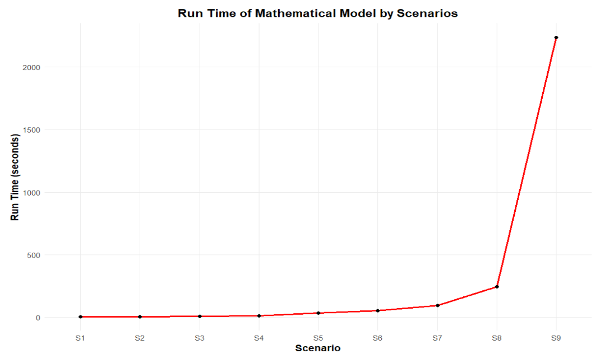
<figcaption>Runtime of the Mathematical Model by Scenarios</figcaption>
</figure>

<figure id="fig:placeholder" data-latex-placement="h!">
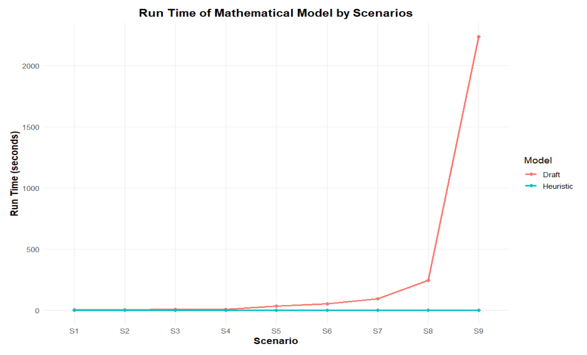
<figcaption>Run Times of the Mathematical Model and Heuristic Approach
by Scenario</figcaption>
</figure>

For these reasons, adopting a heuristic methodology becomes not merely
advantageous but methodologically necessary. A heuristic approach can
generate high-quality solutions within bounded and predictable time
limits, and bypass exhaustive search procedures that dominate exact
solvers under complex conditions. Also, it can enable long-term horizon
simulations that would otherwise be computationally prohibitive.

### Verification of the Hierarchical Heuristic

To assess the reliability of the rolling horizon heuristic, the exact
solution and the heuristic were run over a full-year horizon under the
same demand patterns. Since the heuristic is hierarchical and
state-dependent, it was executed iteratively: the long-term plan was
re-optimized every four weeks, the short-term plan was re-optimized
weekly, and the resulting production and inventory states were carried
forward to the next iteration. As the heuristic approaches the end of
the year, periods that fall outside the remaining planning window are
treated as having zero demand, which is a standard rolling-horizon
convention and may create mild end-of-horizon effects.

When comparing the heuristic against the exact solution across demand
patterns, three performance indicators were tracked: total objective
value, the amount of backlog exceeding ten days, and average lateness
per unit. The average lateness per unit is reported as a
demand-normalized measure, which allows comparison across scenarios with
different total order volumes.

In demand patterns where the annual load is below capacity and demand is
not strongly clustered, the heuristic behaves close to the exact
solution in terms of long-overdue backlog. In these settings, backlog
exceeding ten days is typically absent. In the few cases where it
appears, it remains very small relative to total annual orders. Although
the heuristic may generate higher short-lived backlog totals than the
exact solution, this difference mainly translates into small changes in
average lateness per unit. Across the below-capacity scenarios
evaluated, the objective deviation did not exceed approximately 20
percent, and the increase in average lateness per unit remained below
roughly half a day.

As demand approaches capacity, all three indicators reach their highest
levels among the realistic scenarios. In the most tightly loaded cases,
backlog exceeding ten days becomes nonzero for the heuristic and
corresponds to roughly a few days of production volume. However, in the
observed results this quantity did not exceed about 0.1 percent of total
annual orders. In these same cases, the average lateness per unit
remains interpretable: the heuristic increases short-lived backlog
compared to the benchmark, but the implied average lateness stays within
a limited range rather than escalating to persistent congestion.

In demand patterns that exceed capacity and exhibit heavy clustering,
backlog exceeding ten days increases for both methods. Relative to the
exact solution, the heuristic produces on the order of a few percentage
points more ten-day backlog, around 4 percentage points in the observed
stress runs. The main reason is the sensitivity of rolling decisions to
clustered demand: small timing mismatches in earlier weeks can
accumulate and push part of the backlog beyond the ten-day threshold,
even if the heuristic reacts in subsequent iterations.

Objective value comparisons show that the heuristic remains close to the
exact solution in most settings. In the majority of patterns, the
deviation stays within a moderate band, and under the most extreme
high-demand tests the deviation is only a few percent. In a subset of
patterns, the heuristic begins holding inventory earlier than the
benchmark to suppress long-overdue backlog. This can worsen the
objective value due to increased inventory-related costs, yet it may
still be preferable from an operational perspective when preventing long
backlog is more important than minimizing inventory exposure.

It should be emphasized that the company's typical operating context is
overall below capacity: average annual demand is materially lower than
average annual capacity, even though demand may temporarily approach
capacity in a limited number of peak months. Therefore, the low-demand
and below-capacity scenarios constitute the primary consideration for
method selection, while the near-capacity and above-capacity cases serve
mainly as stress tests to examine robustness under extreme clustering
and overload.

Overall, as shown in Figure [5](#fig:mha){reference-type="ref"
reference="fig:mha"}, these results indicate that the rolling horizon
heuristic reproduces the main backlog and inventory logic of the exact
solution under diverse demand timing and magnitude patterns. It is
especially relevant for the company's dominant operating range where
annual average demand is below annual average capacity: long-overdue
backlog is typically avoided, objective deviation remains bounded, and
average lateness per unit increases only modestly. Under near-capacity
and above-capacity stress tests, performance degrades in a predictable
way, with the main impact concentrated in the ten-day backlog indicator,
supporting the heuristic as a practical alternative when the exact
solution becomes computationally expensive.\

<figure id="fig:mha" data-latex-placement="h!">
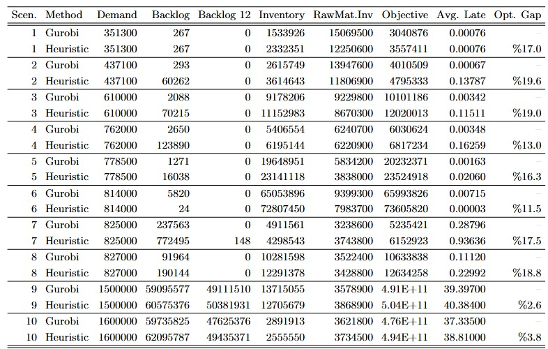
<figcaption>Comparison between mathematical model and heuristic
approach</figcaption>
</figure>

### Verification of the Stochastic Solution Approach

Since the two-stage stochastic solution approach is only implemented on
the long-term mathematical model, the verification of this
implementation has been done by conducting a logical comparison with the
deterministic approach, changing the stochasticity parameters,
conducting a $VSS$ (Value of Stochastic Solution) computation, and
examining the output of the hierarchical decision support system after
implementation. First, an output comparison between the deterministic
and the stochastic long-term model was made. Both models had been run
with the same demand parameters, with only one scenario available
(original demand scenario) in the stochastic model. Final outputs of
both models showed exactly the same resulting inventory and production
decisions.

Then, a $VSS$ analysis was conducted to measure the benefit of using the
stochastic solution approach. First, the full-horizon stochastic model
(Recourse Problem) was solved to obtain the stochastic objective value,
in which demand uncertainty was represented by a set of 10 possible
scenarios with 15% variance. Then, the corresponding expected value (EV)
model was constructed by replacing uncertain demand parameters with
their expected values and solving this deterministic approximation. The
solution obtained from the EV model was evaluated under the original
stochastic model to compute the expected result of the expected-value
solution (EEV). For this project's minimization problem, the $VSS$ is
calculated as

$$VSS = EEV - RP$$

where $RP$ denotes the optimal objective value of the stochastic
recourse problem, and $EEV$ denotes the expected performance of the
expected-value solution under uncertainty. These calculations were made
for 100 different iterations by changing the demand parameter structure
randomly (25% variance from the original demand setup). As a result, the
benefit of using a stochastic solution approach has been proven by
obtaining non-negative $VSS$ for each iteration. Also, $VSS$ analysis
shows that the average objective value of the stochastic model solution
is significantly lower due to high demand uncertainty and enormous
backlog costs. The VSS analysis results, which are made by 100
iterations, are shown in the table [1](#tab:vss){reference-type="ref"
reference="tab:vss"} below.

::: {#tab:vss}
+-------------------------------+---------------+
| Average $RP$ Objective Value  | 4,454,400     |
+:==============================+:==============+
| Average $EEV$ Objective Value | 41,626,235    |
+-------------------------------+---------------+
| Average $VSS$ ($EEV - RP$)    | 37,171,834    |
+-------------------------------+---------------+
| Average $VSS$ (avg of %)      | 80.48%        |
+-------------------------------+---------------+
| Min $VSS$                     | 0.00          |
+-------------------------------+---------------+
| Max $VSS$                     | 87,435,901    |
+-------------------------------+---------------+

: VSS analysis results
:::

After this phase, both deterministic and stochastic solution approaches
had been tested with the yearly rolling horizon methodology. The logical
expectation for the outputs of the stochastic solution approach had been
successfully satisfied. The stochastic model had been run with ten
scenarios generated from the initial forecast, with a maximum 15%
variance from the initial forecast. The stochastic model generated a
higher amount of inventory decisions on a yearly basis. The reason for
this output was that under the uncertainty of demand, the probability of
facing a greater demand than expected generates a huge amount of risk
due to the enormous backlog costs. The model tries to lower the risk of
these possible backlogs in the future by keeping more products in the
inventory, which increases the total holding cost of the stochastic
model. In the end, when both models face differences between the
forecast and the realized demand, the stochastic model generates an
inventory plan with lower total cost, lower backlog cost, and a higher
holding cost, as shown in table [2](#tab.rhvss){reference-type="ref"
reference="tab.rhvss"}.

::: {#tab.rhvss}
                      Stochastic   Deterministic   Difference
  ------------------- ------------ --------------- ------------
  Avg. Holding Cost   5,634,045    2,901,458       -2,732,587
  Avg. Backlog Cost   48,057,008   89,656,018      41,599,010
  Avg. Total Cost     53,691,052   92,557,476      38,866,424

  : Cost comparisons of stochastic and deterministic models
:::

Also, changing stochastic parameters, such as the number of scenarios
and the deviation between these scenarios, showed logical results. The
model had run with changing the number of scenarios from five to twenty,
and changing the variance between 5% to 25%. Adjusting different demand
variances for scenarios caused higher uncertainty in the model, which
resulted in higher inventory decisions and holding costs. The weight of
the worst-case scenarios on the inventory decisions is heavy, due to
huge backlog costs. In conclusion, the verification step of the
stochastic solution approach has shown logical results for each case and
has also been implemented successfully on our solution approach.

## Validation

In the validation phase, real company input data and forecast structures
were used to run the rolling horizon decision support system over the
planning horizon. The purpose of this phase was to evaluate whether the
outputs of the proposed long-term and short-term planning structure are
compatible with the company's production environment and operational
priorities. The outputs were analyzed in terms of demand satisfaction,
backlog behavior, inventory build-ahead decisions, and consistency with
the company's production structure. In this sense, the validation study
mainly relies on expert opinion and output-based operational validity,
rather than a full pilot implementation.

The analysis showed that the model behaves in a way that is consistent
with the company's planning logic and business needs. During peak demand
periods, the system builds inventory ahead and uses this inventory to
reduce the risk of excessive backlog in later periods. This behavior was
found to be aligned with the company's description of a desirable
planning approach. In addition, the raw material side of the system was
modeled with a policy-based mechanism rather than full short-term
optimization for all materials. This modeling choice was made due to the
limited short-term planning horizon and was explicitly recommended by
the industrial advisor as a practical and efficient way to represent
procurement behavior within the current project scope.

Another important validation outcome is that the rolling horizon
structure can adapt to forecast updates during the year. When updated
forecasts decrease, the model correspondingly reduces build-ahead and
production levels to avoid unnecessary inventory accumulation. When
updated forecasts increase, the model tries to respond by using all
available planning flexibility, including available capacity and
previously built inventory, in order to keep backlog under control.
According to the feedback received from the industrial advisor, this
adaptive behavior is both realistic and operationally desirable for the
company. Therefore, the validation results support that the proposed
decision support system is a credible representation of the planning
problem and that its outputs are suitable for practical use in the
company environment.

Figure [6](#fig:valid){reference-type="ref" reference="fig:valid"},
which shows the yearly evolution of production-demand balance can be
used to further support this validation. This visualization helps to
demonstrate that the model output not only remains feasible but also
follows a planning pattern that is interpretable and consistent with
company practice.

<figure id="fig:valid" data-latex-placement="h!">
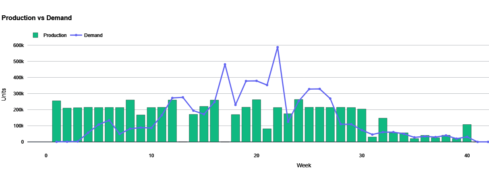
<figcaption>Production and Demand Levels Throughout the
Year</figcaption>
</figure>

# Outcome and Deliverables

## Outcome

The outcome of this project is a decision support system that delivers
quantitative production and inventory plans for Nesco's BobaCo brand.
The system generates results over the entire planning horizon, including
daily production decisions for each product and optimized inventory
levels for both semi-finished and finished goods. It specifies how much
inventory should be built up in advance to prepare for seasonal demand
and reports the raw material quantities required to support the planned
production. Overall, the outcome is a comprehensive planning tool that
links monthly and daily decisions, ensuring feasible, balanced, and
well-organized production and inventory plans for BobaCo's operations.\

## Deliverables

The main deliverable of this project is a decision support system that
coordinates BobaCo's production and inventory planning. This system is
built around an integrated optimization model that determines monthly
output levels, daily production schedules, and inventory levels over the
planning horizon. The model explicitly accounts for capacity limits,
seasonal demand patterns, line-specific constraints, and product shelf
life. Based on the resulting plan, the system also computes the required
raw material quantities implied by the planned production levels. 

Since the integrated model cannot be solved to optimality within a
reasonable computation time, the decision support system employs a
hierarchical heuristic embedded in the same interface. This heuristic
approximates the model by decomposing it into a long-term planning step
that sets monthly production and inventory targets and a short-term
scheduling step that translates these targets into feasible daily
production plans on each line. Thus, the long-term and short-term
structure is used as the solution approach. Furthermore, to address
demand uncertainty, the long-term tier integrates a two-stage stochastic
programming formulation that evaluates multiple demand scenarios
generated from a base forecast.

The system has been successfully developed as a Python-based software
application, the Weekly Planner. This tool accepts user inputs via a
web-based interface built with Streamlit and uses historical sales data
and capacity constraints defined in Excel spreadsheets. Python
optimization scripts process this data to produce actionable production
and inventory planning results. Output is displayed dynamically through
interactive charts and data tables, ensuring the system can perform the
core tasks of accepting inputs, running the optimization models, and
clearly presenting the outputs to the planners. 

In practice, users configure the expected demand forecasts, capacities,
cost parameters, and uncertainty bounds through the application sidebar.
Inputs can be updated on a rolling basis; long-term parameters are
typically revised monthly, and short-term data is updated weekly. The
decision support system then generates the optimal aggregate production
and inventory plans, along with detailed daily production line
assignments and period-by-period raw material requirement orders. For
archival and reporting, all tabular results can be exported directly to
detailed multi-sheet Excel files. 

Finally, the software suite is accompanied by a comprehensive User
Manual. This manual provides detailed, step-by-step instructions with
interface screenshots on how to configure and execute the Weekly Planner
application. It specifies how to interpret the model outputs, update
parameters for the rolling horizon, and apply the stochastic planning
tools intuitively. This combined package ensures the company can deploy
the deliverable into their operations and utilize it effectively during
the upcoming pilot study and future planning cycles.

The prototype of the user interface, the user manual for the UI, and the
input template, which will be used for the decision support system, can
be seen in Appendix [7](#sec:first-app){reference-type="ref"
reference="sec:first-app"}.\

## Benchmarking and Benefits to the Company

After completing the validation phase, a benchmarking analysis was
conducted to compare the proposed decision support system with the
company's current planning approach under the same demand inputs. In
this comparison, the current system was approximated by a 35-day
backward allocation rule. Since the company reacts to delays exceeding
12 days by using overtime, the benchmarking mainly focuses on KPIs
related to backlog risk and overtime dependency.

The following KPIs were used in the comparison:

- **Backlogs Under Cancellation Risk**: This KPI records the amount of
  backlog that exceeds 12 days. Since such delays are operationally
  critical for the company, reducing this amount is one of the main
  targets of the proposed system.

<!-- -->

- **Overtime Days**: This KPI measures the number of days on which
  overtime production is required. It directly shows how much the
  planning approach depends on reactive capacity usage.

<!-- -->

- **Overtime Delivery Rate**: This KPI measures the share of total
  demand that must be recovered through overtime-related production. It
  is used to quantify how much of total yearly demand cannot be handled
  within regular capacity.

Under the original 2026 forecast, the current system required 11
overtime days and created 380,709 units of backlog under cancellation
risk out of a total demand of 6,330,210 units, corresponding to an
overtime-related delivery rate of 6.01%. Under the same forecast, the
proposed system eliminated this need completely and produced no residual
backlog.

To test the robustness of the proposed system under uncertainty, 10
additional demand scenarios were generated around the same monthly
forecast. In these scenarios, monthly product-level demand totals were
allowed to deviate by at most 25% from the forecast, and the
corresponding demand was randomly distributed across the working days of
each month. This allowed the benchmarking process to evaluate the
planning systems under a wider range of possible yearly demand
realizations instead of relying only on a single forecast path.

Across these 10 scenarios, the current system required between 17 and 37
overtime days, with an average of 28.2 days, and created a total of
8,082,588 units of backlog under cancellation risk over 64,721,203 units
of total demand, corresponding to a weighted risk ratio of 12.49%. In
contrast, the proposed system achieved zero backlog and zero overtime in
7 of the 10 scenarios. In the remaining 3 scenarios, it required only 1
overtime day and created only limited residual backlog. Across all 10
scenarios, the proposed system's average overtime requirement was 0.3
days, and its total remaining backlog was only 49,330 units,
corresponding to a ratio of 0.08% of total demand.

These findings show that the company's current planning logic is highly
sensitive to demand fluctuations and frequently requires reactive
overtime to recover delayed orders. The proposed rolling-horizon
decision support system performs much more robustly by building
inventory ahead when necessary and by reducing the accumulation of
backlog beyond the 12-day tolerance window. Therefore, the main benefit
to the company is not only a reduction in backlog risk, but also a
substantial reduction in overtime dependency under both the base
forecast and the generated demand scenarios. Since raw material shortage
based infeasibilities were excluded from this comparison, the reported
improvement should be interpreted specifically as the benefit of better
production planning and proactive inventory build-ahead.

::: {#tab:benchmark_results}
  **Metric**                                          **Current System**   **Proposed System**
  -------------------------------------------------- -------------------- ---------------------
  Base-case overtime days                                     11                    0
  Base-case overtime-dependent volume                      380,709                  0
  Base-case overtime delivery rate                          6.01%                 0.00%
  Average overtime days across 10 scenarios                  28.2                  0.3
  Range of overtime days across scenarios                   17--37                0--1
  Weighted overtime-related / delayed volume ratio          12.49%                0.08%
  Scenarios with zero backlog and zero overtime              0/10                 7/10

  : Benchmarking Results for the Current and Proposed Systems
:::

## Implementation and Pilot Study

The decision support system was integrated into the company's weekly
production planning process through a structured four-week pilot study.
The main objective of the pilot was to measure how much of the upcoming
months' forecasted demand can be proactively converted into inventory
through the planning decisions generated by the system. To support
evaluation during the pilot period, a simple weekly inventory snapshot
routine was used to record starting inventory levels and monitor
inventory evolution over time. At the end of the pilot period, results
were summarized based on the weekly decision logs and inventory
observations, focusing on inventory coverage progress, practicality of
the recommended plans, and integration into the weekly planning routine.
These findings guided the final refinements and support the transition
toward sustained operational use.

In coordination with company representatives, an interface was developed
in line with the firm's existing reporting practices, which facilitated
adoption by planners. Figure
[7](#fig:weekly_output){reference-type="ref"
reference="fig:weekly_output"} presents the user interface of the
decision support system together with a sample weekly production
schedule generated by the system. The first week was conducted under the
close supervision of the project team, while the following weeks were
carried out directly by the company within its regular planning routine.
On a weekly basis, the tool generated recommended production quantities
and raw material order decisions based on updated demand information and
current operational inputs. These recommendations were reviewed every
Monday for feasibility and shop-floor consistency, and the finalized
plans and manual adjustments were documented in weekly decision records.

<figure id="fig:weekly_output" data-latex-placement="h!">
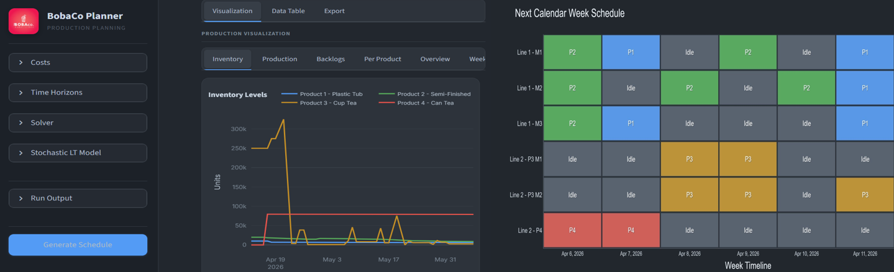
<figcaption>System interface and sample weekly schedule
output.</figcaption>
</figure>

During the pilot study, the decision support system generated weekly
production plans in a consistent and operationally interpretable manner.
The company reviewed these recommendations each week and approved them
as feasible for its regular planning process. In some weeks, the system
recommended producing slightly more than the company's immediate
production plan and holding the excess quantity as inventory. Although
the pilot study period did not fully coincide with the peak-demand
season, the company considered this behavior positive because it
reflected the project's main purpose: preparing for future demand
increases through proactive inventory build-ahead. Therefore, the pilot
study did not directly measure the full peak-season impact of the
system, but it confirmed that the model's weekly decisions were
understandable, feasible, and consistent with the company's objective of
using available capacity to prepare for high-demand periods.

# Conclusion and Future Work

The project met the company's expectations by developing a decision
support system that improves production planning under seasonal and
uncertain demand. The proposed structure combines hierarchical
production planning, a stochastic long-term model, a short-term
production planning model, and a rolling-horizon mechanism to produce
plans that are both operationally feasible and responsive to changing
conditions. The validation results showed that the system supports
proactive inventory build-ahead and reacts quickly to forecast updates
and changes in available workdays. In addition, the yearly
rolling-horizon implementation results indicated that the stochastic
approach provides a more robust balance between inventory protection and
backlog risk under uncertainty, reducing the average total cost by
42.0%. This relatively great improvement is mainly due to the model
structure, where backlog costs are much higher than holding costs, so
carrying additional inventory helps avoid much larger backlog-related
losses.

The practical value of the system was also demonstrated through
benchmarking and pilot use. Compared with the company's current planning
logic, the proposed approach substantially reduced overtime dependency,
lowering average overtime requirement from 28.2 days to 0.3 days and
achieving zero backlog and zero overtime in 7 out of 10 generated demand
scenarios. In addition, the four-week pilot study showed that the system
could be incorporated into the company's weekly planning routine and
could support inventory positioning for the high demand anticipated in
the 2026 summer forecast. Future work may focus on improving the
scenario generation structure through observations collected over longer
periods, allowing demand uncertainty to be represented in an even more
realistic way.

# Appendix User Interface  {#sec:first-app}

<figure id="fig:placeholder" data-latex-placement="h!">
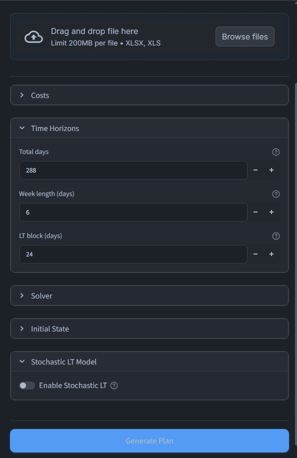
<figcaption>The Input Field of the User Interface</figcaption>
</figure>

<figure id="fig:placeholder" data-latex-placement="h!">
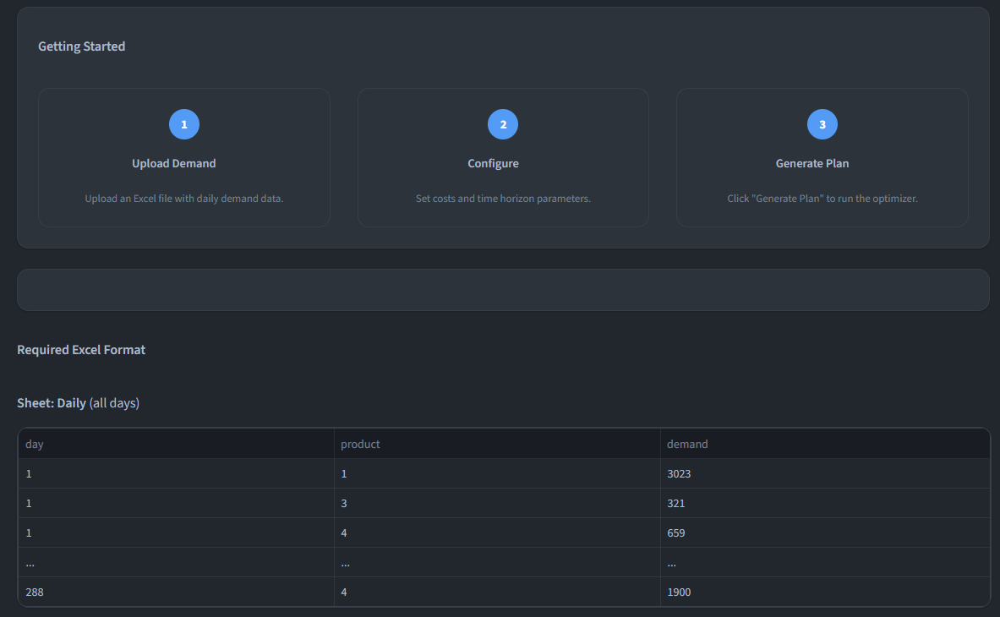
<figcaption>The User Interface Manual</figcaption>
</figure>

<figure id="fig:placeholder" data-latex-placement="h!">
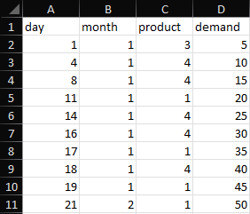
<figcaption>An artificial example of an Excel input template needed for
the decision support system</figcaption>
</figure>

<figure id="fig:placeholder" data-latex-placement="h!">
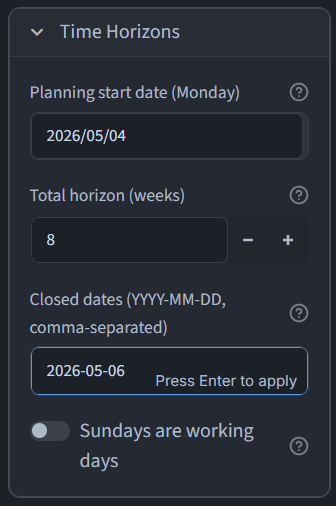
<figcaption>Time horizon configuration panel of the decision support
interface </figcaption>
</figure>

<figure id="fig:placeholder" data-latex-placement="h!">

<figcaption>Initial state upload panel of the decision support interface
</figcaption>
</figure>

<figure id="fig:placeholder" data-latex-placement="h!">

<figcaption>File upload manual</figcaption>
</figure>
