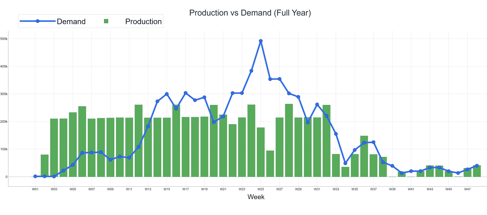

# Company Description

NESCO is a domestically managed food and beverage company founded in
2016 and headquartered in Ankara, Türkiye, operating with an innovative
approach in the industry. From raw material sourcing and product
development to production, worldwide sales, and distribution, NESCO
manages all major functions of its value chain in-house, allowing it to
maintain product quality and respond flexibly to customer needs. It
supplies more than 3,500 companies in Turkey and exports to over 30
countries, serving both domestic HORECA and international B2B customers.
Its fastest-growing brand, BobaCo, is among the first brands to
manufacture bubble tea on an industrial scale in Türkiye, with 25
distinct popping boba flavors [@BobaCo]. The products are primarily
supplied through a B2B model to cafés, coffee chains, restaurants,
hotels, and beverage brands, while some formats are also offered in
retail packaging.

# System Analysis and Problem Definition

## System Analysis

The BobaCo production system consists of four interrelated products:
Plastic Tub Boba, Semi-Finished Boba in Tub, Cup Bubble Tea, and Can
Bubble Tea. Plastic Tub Boba is sold directly as a finished product,
mainly for the domestic market, whereas Semi-Finished Boba in Tub serves
only as an input in the production of Cup and Can Bubble Tea. Production
is organized on two lines. The first line produces Plastic Tubs and
Semi-Finished Boba, which follow the same production flow but differ in
formulation, making them operationally similar yet distinct for
planning. The second line produces Cup and Can Bubble Tea, but due to
pasteurization constraints, these two products cannot be produced on the
same day. In addition, once a line is assigned to a product, it cannot
switch to another on the same day, so each line can process at most one
product per day.

## Problem Definition

In previous years, the company faced pronounced demand peaks during the
summer season. However, meeting this demand was difficult due to limited
production capacity. Although product shelf life allows inventory to be
carried over multiple months, limited storage space in the previous
facility prevented the company from building inventory ahead. With the
transition to a new facility, storage limitations have eased, creating
the opportunity to build inventory in advance. This shift makes it
essential to develop a planning approach that coordinates production
capacity and inventory decisions over time. The key challenge is to
balance holding and backlogging costs while maintaining production
feasibility for both raw materials and finished goods under seasonal and
uncertain demand. The company prepares its production plan and schedule
semi-manually by evaluating market insights, past experiences, and
previous demand data. Since demand, particularly in the domestic market,
is both seasonal and difficult to predict precisely, a reliable and
mathematically grounded decision support system is needed to support
production planning under uncertainty. The objective of this decision
support system is to generate a production plan that determines the
appropriate production and stocking levels of different product types,
minimizing holding and backlogging costs during the high-demand season
while satisfying system requirements. Accordingly, the problem extends
beyond simple capacity allocation and requires coordinated production
and inventory decisions under seasonal and uncertain demand.

# Proposed Solution Approach

## Critical Assumptions

There were several critical assumptions made in order to create the
models effectively and efficiently. Semi-finished Boba and Tub Boba are
considered as different products. Each production line can produce at
most one product type per day. Backlogging is allowed in the system to
preserve feasibility; however, delays within two weeks are treated as
non-critical, whereas delays beyond two weeks are considered more severe
and are penalized more heavily to reflect the risk of order
cancellations.

## Major Constraints

Production lines cannot switch between products within the same day.
There are two production lines: the first line produces Plastic Tub Boba
and Semi-Finished Boba, while the second line produces Cup and Can
Bubble Tea. Total production in each period is limited by the available
workdays, excluding overtime. Since Semi-Finished Boba is not directly
demanded, it is used as an input in the production of Cup and Can
products. Semi-Finished Boba may also be stored for future use. The
remaining products are directly demanded by end customers and may also
be stored. Storage area of the facility is limited, meaning that the
total area occupied by stored products cannot exceed the available
capacity. In addition, raw material availability is constrained by
procurement lead times and minimum order quantities. Backlogging is
allowed, but delays exceeding 12 days are treated as critical through an
additional penalty structure.

## Objectives

The primary objective is to determine a long-term production and
inventory strategy that minimizes holding and backlog costs while
ensuring adequate inventory coverage for the high-demand season. Since
backlog costs are higher than inventory holding costs, the planning
approach is designed to discourage excessive delay while avoiding
unnecessary inventory buildup.

## Conceptual Model

The main model is formulated as a multi-period production and inventory
planning structure that represents how products flow through production,
inventory, and demand fulfillment over time. Within this structure,
production decisions determine period-by-period output, inventory allows
available stock to be carried into future periods, and backlog captures
unmet demand that is postponed to later periods.

The model also captures the structural dependency among products within
the system. While Plastic Tub Boba, Cup Bubble Tea, and Can Bubble Tea
are directly demanded products, Semi-Finished Boba is not directly
demanded and instead serves as an input for Cup and Can Bubble Tea.
Accordingly, the system is represented as an integrated planning
structure in which production and inventory decisions for different
products must remain coordinated and consistent over the planning
horizon.

## Heuristic Solution Method

### Hierarchical Heuristic Approach

The initial "full-scale" model was formulated at a daily resolution over
a one-year horizon and tailored to the facility's specific operational
restrictions and characteristics to reflect the production system
accurately. However, solving a fully integrated, daily, full-year model
within a reasonable runtime becomes computationally challenging due to
the size of the decision space. Therefore, a hierarchical heuristic
approach is adopted by decomposing the planning problem into two
coordinated models: a long-term aggregate production planning model
given in Appendix [8](#app:A){reference-type="ref" reference="app:A"}
and a short-term production planning model given in
Appendix [9](#app:B){reference-type="ref" reference="app:B"},
implemented with a rolling-horizon mechanism  [@bitran1982hpp]. This
hierarchical coordination between the long-term and short-term models is
illustrated in Figure [1](#fig:Hierarchical_models){reference-type="ref"
reference="fig:Hierarchical_models"}.

<figure id="fig:Hierarchical_models" data-latex-placement="h!">

<figcaption>Hierarchical Models Diagram</figcaption>
</figure>

### Stochastic Long-Term Model

The long-term model determines strategic inventory targets over a
one-year horizon at a monthly level. It identifies in which months
production should be increased to prepare for peak-season demand and
sets targeted monthly inventory levels. The long-term model optimizes
these targets by minimizing expected total cost, including inventory
holding and backlog-related penalty components, while maintaining
consistency with major system limits and planning rules
 [\[eq:A1\]](#eq:A1){reference-type="eqref" reference="eq:A1"}.

To account for demand uncertainty, the long-term model is formulated as
a two-stage stochastic program, in which demand for the first two months
is treated as deterministic, while demand in the remaining periods of
the planning horizon is modeled as random [@BirgeLouveaux2011]. Based on
the deviation margins provided by the company, an uncertainty band is
defined around the company's baseline forecast, and multiple demand
scenarios are generated accordingly. Equal probabilities are assigned to
each scenario, and the long-term model evaluates the expected total cost
across the scenario set. This scenario-based formulation produces
monthly inventory targets that are more resilient to uncertainty and
reduces the limitations of relying on a single forecast.

### Short-Term Production Planning Model

The short-term model uses the inventory decisions for the first two
months obtained from the long-term model as input and translates the
monthly inventory targets into operationally feasible daily decisions
within an eight-week planning horizon
 [\[eq:B11\]](#eq:B11){reference-type="eqref" reference="eq:B11"}. In
particular, it generates a detailed daily production plan that aligns
with the facility's line-level constraints and converts the higher-level
inventory targets into executable production quantities, inventory
updates, and short-term fulfillment decisions
[\[eq:B2\]](#eq:B2){reference-type="eqref" reference="eq:B2"}. It also
generates raw material order decisions to ensure material availability
and maintain consistency between short-term production requirements and
procurement needs [\[eq:B7\]](#eq:B7){reference-type="eqref"
reference="eq:B7"},[\[eq:B8\]](#eq:B8){reference-type="eqref"
reference="eq:B8"}. In this way, the proposed heuristic approach
combines daily production planning in the short-term model with
inventory targets generated by the long-term model, resulting in a
hierarchical decision support structure that improves peak-season
planning while maintaining computational and operational feasibility.

### Rolling-Horizon Structure

The two models operate under a rolling-horizon structure: the long-term
model is re-run on a monthly basis to refresh monthly inventory targets
as new information becomes available, while the short-term model is
updated weekly to produce an actionable near-term schedule.

# Validation

Using the company's actual input data and forecast structure, the
rolling-horizon decision support system produced planning patterns
consistent with the company's operational logic. In particular, during
peak-demand periods, the system builds inventory ahead and later uses
this inventory to control backlog. It was also observed that when
forecasts are updated or available workdays decrease, the
rolling-horizon structure responds quickly by revising build-ahead and
production decisions, making the system more responsive to changing
operating conditions. As shown in Figure
[2](#fig:Pro_dem){reference-type="ref" reference="fig:Pro_dem"}, the
model initially built inventory in anticipation of higher forecasted
demand, and later reduced production when realized demand turned out to
be lower than expected. This behavior is well aligned with the company's
planning needs, since the main challenge in the current system is not
only meeting seasonal demand, but also reacting in a timely and
structured manner to changing production conditions.

<figure id="fig:Pro_dem" data-latex-placement="h!">

<figcaption>Production and Demand Levels Throughout the
Year</figcaption>
</figure>

Both the rolling-horizon structure and the stochastic long-term
component contribute meaningfully to the company's ability to prepare
for future demand scenarios. While the rolling-horizon structure
improves the company's ability to respond to demand changes in a timely
and consistent manner, the stochastic long-term model generates more
protective inventory targets under uncertainty. In the yearly
rolling-horizon implementation, this more cautious inventory policy
increased the average holding-cost component by 94.2%, while reducing
the average backlog-cost component by 46.4%. This result is consistent
with the model structure, since backlog costs are very large and the
stochastic model reacts to uncertainty by keeping more inventory in
order to reduce the risk of future backlog. Accordingly, although the
holding-cost component increases, the stochastic approach reduces the
average total cost by 42.0%. These values should be interpreted as
model-based performance measures rather than direct accounting costs,
but they still indicate that the stochastic policy provides a more
robust balance between inventory protection and backlog risk under
uncertainty.

# Benchmarking and Benefits

Benchmarking analysis was conducted to compare the proposed decision
support system with the company's current planning approach under the
same demand inputs. In this comparison, the current system was
represented by a 45-day backward allocation rule. Since the company
responds to delays exceeding 12 days through overtime usage, the
benchmarking focuses on backlog risk and overtime dependency. The
following KPIs were used in the comparison: Backlog Under Cancellation
Risk, Overtime Days, and Overtime Delivery Rate (the share of total
demand that must be recovered through overtime production).

Under the original 2026 forecast, the current system required 11
overtime days and created 380,709 units of backlog under cancellation
risk out of a total demand of 6,330,210 units. This corresponds to 6.01%
of total demand being under cancellation risk. Under the same forecast,
the proposed system eliminated overtime need completely and produced no
residual backlog.

To test the robustness of the proposed system under uncertainty, 10
demand scenarios were generated around a monthly forecast. Under these
scenarios, the current system required between 17 and 37 overtime days,
with an average of 28.2 days, and created 8,082,588 units of backlog
under cancellation risk over a total demand of 64,721,203 units,
corresponding to a weighted backlog-under-cancellation-risk ratio of
12.49%. In contrast, the proposed system achieved zero backlog and zero
overtime in 7 of the 10 scenarios. In the remaining 3 scenarios, it
required just 1 overtime day and generated limited residual backlog.
Overall, its average overtime requirement was 0.3 days, and its total
remaining backlog was 49,330 units, corresponding to 0.08% of total
demand. A summary of the comparative performance of the current and
proposed systems is presented in Table
[1](#tab:benchmark_results){reference-type="ref"
reference="tab:benchmark_results"}.

::: {#tab:benchmark_results}
  **Metric**                                        **Current System**   **Proposed System**
  ------------------------------------------------ -------------------- ---------------------
  Average overtime days across 10 scenarios                28.2                  0.3
  Weighted backlog-under-cancellation-risk ratio          12.49%                0.08%
  Scenarios with zero backlog and zero overtime            0/10                 7/10

  : Scenario-based results for the current and proposed systems
:::

These findings show that the company's current planning logic is highly
sensitive to demand fluctuations and frequently requires reactive
overtime to recover delayed orders. The proposed rolling-horizon
decision support system performs much more robustly by building
inventory ahead when necessary and limiting backlog accumulation beyond
the 12-day tolerance window. Therefore, the main benefit to the company
is not only a reduction in backlog risk, but also a substantial
reduction in overtime dependency under both the base forecast and the
generated demand scenarios. Numerically, this means that the proposed
system reduces the average overtime requirement from 28.2 days to 0.3
days and achieves zero backlog and zero overtime in 7 out of 10
generated demand scenarios.

# Implementation and Pilot Study

The decision support system was integrated into the company's weekly
production planning process through a structured four-week pilot study.
In coordination with company representatives, an interface was developed
in line with the firm's existing reporting practices, which facilitated
adoption by planners. Figure
[3](#fig:weekly_output){reference-type="ref"
reference="fig:weekly_output"} presents the user interface of the
decision support system together with a sample weekly production
schedule generated by the system. The first week was conducted under the
close supervision of the project team, while the following weeks were
carried out directly by the company within its regular planning routine.
On a weekly basis, the tool generated recommended production quantities
and raw material order decisions based on updated demand information and
current operational inputs. These recommendations were reviewed every
Monday for feasibility and shop-floor consistency, and the finalized
plans and manual adjustments were documented in weekly decision records.

<figure id="fig:weekly_output" data-latex-placement="h!">

<figcaption>System interface and sample weekly schedule
output.</figcaption>
</figure>

The pilot study confirmed that the system could support proactive
inventory build-ahead in response to forecasted peak-season demand. In
particular, the system led the company to hold inventory that it had not
originally planned to keep, but that was necessary to prepare for the
high demand anticipated in the 2026 summer forecast. Weekly inventory
quantities were recorded to monitor stock levels and their evolution
throughout the pilot period. At the end of the study, the recorded
decisions and inventory data indicated that the system's outputs were
compatible with weekly planning requirements and operational practice.
Overall, the pilot met the company's main expectations by demonstrating
both operational practicality and the suitability of the system for
regular use.

# Conclusion

The project met the company's expectations by developing a decision
support system that improves production planning under seasonal and
uncertain demand. The proposed structure combines hierarchical
production planning, a stochastic long-term model, a short-term
production planning model, and a rolling-horizon mechanism to produce
plans that are both operationally feasible and responsive to changing
conditions. The validation results showed that the system supports
proactive inventory build-ahead and reacts quickly to forecast updates
and changes in available workdays. In addition, the yearly
rolling-horizon implementation results indicated that the stochastic
approach provides a more robust balance between inventory protection and
backlog risk under uncertainty, reducing the average total cost by
42.0%. This relatively great improvement is mainly due to the model
structure, where backlog costs are much higher than holding costs, so
carrying additional inventory helps avoid much larger backlog-related
losses.

The practical value of the system was also demonstrated through
benchmarking and pilot use. Compared with the company's current planning
logic, the proposed approach substantially reduced overtime dependency,
lowering average overtime requirement from 28.2 days to 0.3 days and
achieving zero backlog and zero overtime in 7 out of 10 generated demand
scenarios. In addition, the four-week pilot study showed that the system
could be incorporated into the company's weekly planning routine and
could support inventory positioning for the high demand anticipated in
the 2026 summer forecast. Future work may focus on improving the
scenario generation structure through observations collected over longer
periods, allowing demand uncertainty to be represented in an even more
realistic way.

# Stochastic Long-Term Model {#app:A}

**Sets:**

  **Symbol**   **Explanation**
  ------------ ------------------------------------------------------
  $K_1$        Set of Plastic Tub and Semi-Finished Boba products
  $K_2$        Set of Cup Bubble Tea and Can Bubble Tea products
  $T$          Set of planning periods (months), $T=\{1,\dots,12\}$
  $\Omega$     Set of scenarios

**Parameters:**

  **Symbol**         **Explanation**
  ------------------ ---------------------------------------------------------------------------------------------------
  $d_{i,t}$          Demand of product $i\in K_1 \cup K_2$ in period $t \in \{1,2\}$
  $d_{i,t,\omega}$   Demand of $i\in K_1 \cup K_2$ in period $t \in \{3,\dots,12\}$ under scenario $\omega \in \Omega$
  $a_t$              Number of workdays in period $t \in T$
  $b_i$              Backlog cost for product $i \in K_1 \cup K_2$
  $c_1$              Daily unit capacity of production line 1
  $c_{2,i}$          Daily capacity of production line 2 for product $i \in K_2$
  $r_i$              Unit usage area of product $i\in K_1 \cup K_2$
  $u_{i2}$           Number of product 2 used in the product $i \in \{3,4\}$
  $h_i$              Holding cost of product $i\in K_1 \cup K_2$ for one unit per period

**Decision Variables:**

  **Symbol**         **Explanation**
  ------------------ --------------------------------------------------------------------------------------------------------
  $P_{i,t}$          Production of product $i\in K_1 \cup K_2$ in period $t \in \{1,2\}$
  $I_{i,t}$          Inventory of product $i\in K_1 \cup K_2$ at the end of period $t \in \{1,2\}$
  $B_{i,t}$          Backlog of product $i\in K_1 \cup K_2$ in period $t \in \{1,2\}$
  $P_{i,t,\omega}$   Production of $i\in K_1 \cup K_2$ in period $t \in \{3,\dots,12\}$ under scenario $\omega  \in \Omega$
  $I_{i,t,\omega}$   Inventory of $i\in K_1 \cup K_2$ in period $t \in \{3,\dots,12\}$ under scenario $\omega  \in \Omega$
  $B_{i,t,\omega}$   Backlog of $i\in K_1 \cup K_2$ in period $t\in \{3,\dots,12\}$ under scenario $\omega  \in \Omega$

**Objective Function:** $$\begin{flalign}
& \begin{aligned}[t]
\min\ & \sum_{t=1}^{2}\sum_{i \in K_1 \cup K_2} \left(b_i B_{i,t} + h_i I_{i,t}\right) + \sum_{\omega \in \Omega}\sum_{t=3}^{12}\sum_{i \in K_1 \cup K_2}
p_{\omega}\left(b_i B_{i,t,\omega} + h_i I_{i,t,\omega}\right)
\end{aligned}
&& \tag{A.1}\label{eq:A1}
\end{flalign}$$

**Constraints:**

*Production Capacity Constraints:* $$\begin{flalign}
& \sum_{i \in K_1}\frac{P_{i,t}}{c_1} \le a_t \quad , \quad
  \sum_{i \in K_2}\frac{P_{i,t}}{c_{2,i}} \le a_t
&& \forall t \in \{1,2\}
\tag{A.2}\label{eq:A2}
\end{flalign}$$

$$\begin{flalign}
& \sum_{i \in K_1}\frac{P_{i,t,\omega}}{c_1} \le a_t \quad , \quad
  \sum_{i \in K_2}\frac{P_{i,t,\omega}}{c_{2,i}} \le a_t
&& \forall t \in \{3,\dots,12\},\ \forall \omega \in \Omega
\tag{A.3}\label{eq:A3}
\end{flalign}$$

*Inventory Balance for Semi-Finished Boba:* $$\begin{flalign}
& I_{2,t-1} + P_{2,t} - \sum_{i \in K_2} u_{i2} P_{i,t} = I_{2,t}
&& \forall t \in \{1,2\}
\tag{A.4}\label{eq:A4}
\end{flalign}$$

$$\begin{flalign}
& I_{2,t-1,\omega} + P_{2,t,\omega} - \sum_{i \in K_2} u_{i2} P_{i,t,\omega} = I_{2,t,\omega}
&& \forall t \in \{3,\dots,12\},\ \forall \omega \in \Omega
\tag{A.5}\label{eq:A5}
\end{flalign}$$

*Inventory--Backlog Balance for Finished Products:* $$\begin{flalign}
& I_{i,t-1} + P_{i,t} - \left(d_{i,t} + B_{i,t-1}\right) + B_{i,t} = I_{i,t}
&& \forall t \in \{1,2\},\ \forall i \in K\setminus \{2\}
\tag{A.6}\label{eq:A6}
\end{flalign}$$

$$\begin{flalign}
& I_{i,t-1,\omega} + P_{i,t,\omega} - \left(d_{i,t,\omega} + B_{i,t-1,\omega}\right) + B_{i,t,\omega} = I_{i,t,\omega}
&& \forall t \in \{3,\dots,12\},\ \forall \omega \in \Omega,\ \forall i \in K\setminus \{2\}
\tag{A.7}\label{eq:A7}
\end{flalign}$$

*Storage Capacity Constraints:* $$\begin{flalign}
& I^{\max} \ge \sum_{i=1}^{4} r_i I_{i,t}
&& \forall t \in \{1,2\}
\tag{A.8}\label{eq:A8}
\end{flalign}$$

$$\begin{flalign}
& I^{\max} \ge \sum_{i=1}^{4} r_i I_{i,t,\omega}
&& \forall t \in \{3,\dots,12\},\ \forall \omega \in \Omega
\tag{A.9}\label{eq:A9}
\end{flalign}$$

*Non-negativity Constraints:* $$\begin{flalign}
& P_{i,t},\ I_{i,t},\ B_{i,t},\ P_{i,t,\omega},\ I_{i,t,\omega},\ B_{i,t,\omega} \ge 0
&& \forall i \in K,\ \forall t \in T,\ \forall \omega \in \Omega
\tag{A.10}\label{eq:A10}
\end{flalign}$$

# Short-Term Production Planning Model {#app:B}

**Sets:**

  **Symbol**   **Explanation**
  ------------ --------------------------------------------------------
  $K_1$        Set of Plastic Tub and Semi-Finished Boba products
  $K_2$        Set of Cup Bubble Tea and Can Bubble Tea products
  $T$          Set of days in the planning horizon
  $S$          Set of raw materials
  $M$          Set of machines on Line 1, $M=\{1,2,3\}$
  $M_3$        Set of machines for product 3 on Line 2, $M_3=\{1,2\}$

**Parameters:**

  **Symbol**                **Explanation**
  ------------------------- ------------------------------------------------------------------------------------------------------
  $b_i$                     Daily unit backlog cost of product $i \in K_1 \cup K_2$
  $b^{12}_i$                Daily unit backlog cost of product $i \in K_1 \cup K_2$ whose due date has exceeded at least 12 days
  $n_{is}$                  Number of raw material $s \in S$ used in the product $i \in K_1 \cup K_2$
  $LT_s$                    Lead time of raw material $s \in S$
  $\kappa_m$                Daily capacity of machine $m \in M$ on Lines
  $u_{2i}$                  Number of product 2 used in the product $i\in  K_2$
  $d_{i,t}$                 Customer demand of product $i\in K_1 \cup K_2$ at day $t \in T$
  $d^D_{i,1},\ d^D_{i,2}$   Long-term inventory decision parameters
  $h_i$                     Unit holding cost of product $i\in K_1 \cup K_2$
  $h^r_s$                   Unit holding cost of raw material $s \in S$
  $v_i$                     Inventory area usage of one unit of product $i\in K_1 \cup K_2$
  $w_{i,t}$                 Total demand of product $i\in K_1 \cup K_2$ from day $t-12$ to $t \in T$
  $moq_s$                   Minimum order quantity for raw material $s \in S$

**Decision Variables:**

  **Symbol**       **Explanation**
  ---------------- ------------------------------------------------------------------------------------------------------
  $P_{i,t}$        Number of product $i\in K_1 \cup K_2$ produced at day $t \in T$
  $I_{i,t}$        Number of product $i\in K_1 \cup K_2$ in inventory at day $t \in T$
  $I^r_{s,t}$      Number of raw material $s \in S$ in inventory at day $t \in T$
  $R_{s,t}$        Number of raw material $\in Ss$ ordered at day $t \in T$
  $Z_{s,t}$        1 if raw material $s \in S$ ordered at day $t \in T$, 0 otherwise
  $B_{i,t}$        Backlog of product $i\in K_1 \cup K_2$ at day $t \in T$
  $B^{12}_{i,t}$   Backlog of product $i\in K_1 \cup K_2$ at day $t \in T$ whose due date has exceeded at least 12 days
  $X_{m,i,t}$      1 if machine $m \in M$ produces $i \in \{1,2\}$ at day $t \in T$, 0 otherwise
  $X_{m,3,t}$      1 if machine $m \in M_3$ produces 3 at day $t \in T$, 0 otherwise
  $X_{4,t}$        1 if Line 2 produces product 4 at day $t \in T$, 0 otherwise

**Objective Function:** $$\begin{flalign}
& \begin{aligned}[t]
\min\ & \sum_{t \in T}\sum_{i \in K_1 \cup K_2}
\left(b_i B_{i,t} + b_i^{12} B^{12}_{i,t} + h_i I_{i,t}\right) + \sum_{t \in T}\sum_{s \in S} h^r_s I^r_{s,t}
\end{aligned}
&& \tag{B.1}\label{eq:B1}
\end{flalign}$$

**Constraints:**

*Line Assignment Constraints:* $$\begin{flalign}
& X_{m,1,t} + X_{m,2,t} \le 1 \quad , \quad X_{m,3,t} \le 1 - X_{4,t}
&& \forall m \in M,\ \forall t \in T
\tag{B.2}\label{eq:B2}
\end{flalign}$$

*Production Definitions:* $$\begin{flalign}
& P_{1,t} = \sum_{m \in M} \kappa_m X_{m,1,t}
\quad , \quad
P_{2,t} = \sum_{m \in M} \kappa_m X_{m,2,t}
&& \forall t \in T
\tag{B.3}\label{eq:B3}
\end{flalign}$$

$$\begin{flalign}
& P_{3,t} = \sum_{m \in M_3} \kappa^3_m X_{m,3,t}
\quad , \quad
P_{4,t} = \kappa^4 X_{4,t}
&& \forall t \in T
\tag{B.4}\label{eq:B4}
\end{flalign}$$

*Inventory Balance Constraints:* $$\begin{flalign}
& I_{2,t-1} + P_{2,t-1} - \sum_{i \in K_2} u_{2i} P_{i,t} = I_{2,t}
&& \forall t \in T
\tag{B.5}\label{eq:B5}
\end{flalign}$$

$$\begin{flalign}
& I_{i,t-1} + P_{i,t} - \left(d_{i,t} + B_{i,t-1}\right) + B_{i,t} = I_{i,t}
&& \forall t \in T,\ \forall i \in (K_1 \cup K_2)\setminus \{2\}
\tag{B.6}\label{eq:B6}
\end{flalign}$$

*Raw Material Balance and Ordering Constraints:* $$\begin{flalign}
& I^r_{s,t} = I^r_{s,t-1} + R_{s,(t-LT_s)} - \sum_{i \in K_1 \cup K_2} n_{is} P_{i,t}
&& \forall s \in S,\ \forall t \in T
\tag{B.7}\label{eq:B7}
\end{flalign}$$

$$\begin{flalign}
& R_{s,t} \ge moq_s \cdot Z_{s,t}
&& \forall s \in S,\ \forall t \in T
\tag{B.8}\label{eq:B8}
\end{flalign}$$

*Inventory Area Constraints:* $$\begin{flalign}
& I^r_{\max} \ge \sum_{s \in S} v_s I^r_{s,t}
\quad , \quad
I^{\max} \ge \sum_{i \in K_1 \cup K_2} v_i I_{i,t}
&& \forall t \in T
\tag{B.9}\label{eq:B9}
\end{flalign}$$

*Critical Backlog Constraint:* $$\begin{flalign}
& B^{12}_{i,t} \ge B_{i,t} - w_{i,t}
&& \forall i \in K_1 \cup K_2,\ \forall t \in T
\tag{B.10}\label{eq:B10}
\end{flalign}$$

*Long-Term Target Satisfaction Constraints:* $$\begin{flalign}
& I_{i,24} \ge d^D_{i,1}
\quad , \quad
I_{i,48} \ge d^D_{i,2}
&& \forall i \in K_1 \cup K_2
\tag{B.11}\label{eq:B11}
\end{flalign}$$

*Domain Constraints:* $$\begin{flalign}
& X_{m,1,t},\ X_{m,2,t},\ X_{m,3,t},\ X_{4,t} \in \{0,1\}
&& \forall m \in M \cup M_3,\ \forall t \in T
\tag{B.12}\label{eq:B12}
\end{flalign}$$

$$\begin{flalign}
& Z_{s,t} \in \{0,1\}
&& \forall s \in S,\ \forall t \in T
\tag{B.13}\label{eq:B13}
\end{flalign}$$

$$\begin{flalign}
& P_{i,t},\ I_{i,t},\ B_{i,t},\ B^{12}_{i,t},\ I^r_{s,t},\ R_{s,t} \ge 0
&& \forall i \in K_1 \cup K_2,\ \forall t \in T,\ \forall s \in S
\tag{B.14}\label{eq:B14}
\end{flalign}$$
