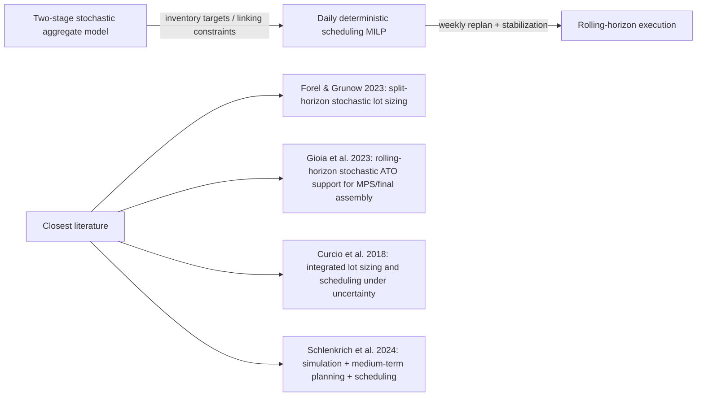

# Novelty Assessment of a Three-Layer Hierarchical Stochastic Production Planning DSS

## Executive summary

This report reconstructs the intended topic from the two uploaded research briefs: a literature-based novelty test for a deployed, three-layer production-planning DSS that combines a two-stage stochastic aggregate model, a separate daily scheduling MILP linked by inventory targets, and weekly rolling-horizon execution in an industrial setting. fileciteturn0file0 fileciteturn0file1

The highest-confidence conclusion is that I did **not** find a published **exact** match to the architecture you want to claim: a **two-stage stochastic aggregate/tactical model** feeding **explicit inventory-target constraints** into a **separate deterministic daily scheduling MILP**, with the combined stack run in a **rolling-horizon execution framework** and described as a **live industrial DSS**. The closest verified papers each capture only part of that stack. Forel and Grunow study **split-horizon stochastic lot sizing in rolling-horizon planning**; Gioia, Fadda, and Brandimarte study **rolling-horizon stochastic planning** that can support a two-level MRP/ERP setting with **master production and final assembly scheduling**; Curcio et al. study **integrated lot sizing and scheduling under multistage demand uncertainty**; Schlenkrich et al. study a **simulation-optimization framework** integrating medium-term planning, scheduling, and shop-floor processing. None of these verified sources describes your exact three-layer, target-passing, deployed architecture. citeturn32view2turn44view0turn32view1turn31view0turn65view3

On the supporting literature, the strongest verified papers for your long-term stochastic layer are Thevenin, Adulyasak, and Cordeau on **multi-item, multi-echelon capacitated lot sizing / MRP under demand uncertainty**, plus newer follow-ons such as Thevenin et al. on multistage/multi-echelon extensions, Schlenkrich and Parragh on **multi-echelon lot sizing with setup carry-over under uncertain demand**, and Sereshti, Adulyasak, and Jans on **stochastic multi-level lot sizing with service-level constraints**. These papers strengthen the claim that the stochastic, BOM-linked planning side is recognized in the literature, even if the particular tactical-to-operational handoff you use appears not to be. citeturn65view2turn65view0turn65view3

Two important cleanups emerged. First, the verified 2013 rolling-horizon review in *International Journal of Production Research* is **Sahin, Narayanan, and Robinson**, not “Sahin, Süral, and Denizel.” Second, I could **not** responsibly resolve the Toledo DOI conflict or verify the alleged “Cruz et al. (2025) in PIOS” and “Mediouni et al. (2021) in *Supply Chain Forum*” citations from authoritative metadata available in this environment, so I would **not** use them in an OR/MS prize submission without a manual Crossref / publisher check. citeturn79view0

The safest novelty sentence, based on the verified literature, is:

> **To the best of our literature review, we found no published study reporting a live industrial decision-support system that jointly combines a two-stage stochastic aggregate planning model, a separate deterministic daily scheduling MILP linked through explicit inventory-target constraints, and weekly rolling-horizon execution; existing studies capture only subsets of this architecture, or embed the elements within a single planning model rather than a deployed hierarchical stack.** citeturn32view2turn44view0turn32view1turn31view0turn65view3

## Scope, evidence base, and assumptions

I prioritized papers and metadata that I could verify directly from accessible article pages, arXiv/ar5iv full-text reference sections, and article abstracts that explicitly described rolling-horizon execution, stochastic lot sizing, multi-echelon / multi-level BOM structure, or integrated planning-and-scheduling formulations. Where the accessible source exposed the full reference entry, I used that version of the citation. Where it did not, I mark the DOI or citation count as **not verified here** rather than guessing. citeturn31view0turn32view0turn32view1turn32view2turn44view0turn65view0turn65view1turn65view2turn65view3turn79view0

The core benchmarking assumption in this report is that an “exact match” must satisfy **all** of the following simultaneously: a stochastic aggregate/tactical layer, a **separate** detailed operational scheduling MILP, an **explicit inter-layer target-passing mechanism** expressed as hard linking constraints, and rolling-horizon execution of the combined stack. Papers that integrate tactical and operational decisions in a **single** model, or papers that use rolling horizon without a separate operational MILP, are therefore treated as **close analogs**, not exact precedents. That framing is consistent with how the recent verified papers describe their own contributions and limitations. citeturn32view1turn32view2turn31view0turn44view0turn65view3

The diagram above is the architecture tested in this review. The verified close analogs either keep long-term and short-term decisions within one model, or they discuss two-level planning support without the explicit inventory-target handoff to a separate daily MILP that your system uses. citeturn32view2turn44view0turn32view1turn31view0

A concise evidence map is below.

| Source | Verified metadata | Credibility and tier | Expected contribution to your paper |
|---|---|---|---|
| Forel & Grunow | “Dynamic stochastic lot sizing with forecast evolution in rolling-horizon planning,” *Production and Operations Management* 32(2), 2023, DOI 10.1111/poms.13881. citeturn32view2 | Top OM journal | Best verified analog for **stochastic split-horizon planning** in a rolling-horizon setting. |
| Gioia, Fadda & Brandimarte | “Rolling horizon policies for multi-stage stochastic assemble-to-order problems,” published in *International Journal of Production Research*; related DOI 10.1080/00207543.2023.2283570. citeturn44view0 | Reputable applied journal | Best verified analog for **rolling-horizon stochastic planning** supporting a **two-level MRP/final-assembly** structure. |
| Curcio et al. | “Adaptation and approximate strategies for solving the lot-sizing and scheduling problem under multistage demand uncertainty,” *International Journal of Production Economics* 202, 2018, DOI 10.1016/j.ijpe.2018.04.012. citeturn32view1 | Reputable applied journal | Strong analog for **stochastic lot sizing + scheduling**, but as an **integrated formulation**, not a hierarchical two-model stack. |
| Thevenin, Adulyasak & Cordeau | “Material Requirements Planning Under Demand Uncertainty Using Stochastic Optimization,” *Production and Operations Management* 30(2), 2021, DOI 10.1111/poms.13277. citeturn32view0turn65view2 | Top OM journal | Best verified foundation for **stochastic multi-echelon / MRP under demand uncertainty**. |
| Schlenkrich & Parragh | “Capacitated multi-item multi-echelon lot sizing with setup carry-over under uncertain demand,” *International Journal of Production Economics* 277, 2024, article 109379. citeturn65view0turn65view3 | Reputable applied journal | Strong recent citation for **multi-echelon stochastic lot sizing with richer production realism**. |
| Sereshti, Adulyasak & Jans | “Managing flexibility in stochastic multi-level lot sizing problem with service level constraints,” *Omega* 122, 2024, article 102957. citeturn65view0turn65view3 | Strong OR journal | Strong recent citation for **stochastic multi-level lot sizing** with service-level emphasis. |
| Sahin, Narayanan & Robinson | “Rolling horizon planning in supply chains: review, implications and directions for future research,” *International Journal of Production Research* 51(18), 2013, DOI 10.1080/00207543.2013.775523. citeturn79view0 | Reputable review journal | Best **verified** rolling-horizon review I could confirm directly. |

## Exact-match novelty question

**Direct answer to the core novelty question:** based on the verified literature I reviewed, **no exact published match was found** for the deployed architecture you described. The best close matches all miss at least one essential element: explicit inter-layer target passing, a separate downstream daily scheduling MILP, or documented live industrial deployment of the full stack. citeturn32view2turn44view0turn32view1turn31view0turn65view3

The closest **published** structural analog is **Forel and Grunow (2023)**: *Dynamic stochastic lot sizing with forecast evolution in rolling-horizon planning*, *Production and Operations Management* 32(2): 449–468, DOI 10.1111/poms.13881. It is important because it explicitly combines **stochastic lot sizing** and **rolling-horizon planning**, and—crucially for your framing—splits the horizon into a **short-term approximation** and a **later stochastic scenario-tree segment**. But the short-term and long-term pieces are still part of one planning formulation; the paper does **not** describe a separate daily scheduling MILP that receives hard inventory targets from the higher-level model. *Journal tier:* top OM journal. *Confidence:* High. *Google Scholar citation count:* not directly verifiable here. citeturn32view2

The closest **two-level planning** analog is **Gioia, Fadda, and Brandimarte (2023)**: *Rolling horizon policies for multi-stage stochastic assemble-to-order problems*, published in *International Journal of Production Research*; related DOI 10.1080/00207543.2023.2283570. Its abstract explicitly states that the approach can support a “two-level approach” based on **master production** and **final assembly scheduling**, which makes it highly relevant for your hierarchical positioning. But the paper does **not** document the tactical model passing inventory targets as hard constraints into a separate detailed MILP, and it is not presented as a live industrial DSS deployment. *Journal tier:* reputable applied journal, below POM/M&SOM/OR. *Confidence:* High. *Google Scholar citation count:* not directly verifiable here. citeturn44view0

The closest **stochastic planning-and-scheduling** analog is **Curcio et al. (2018)**: *Adaptation and approximate strategies for solving the lot-sizing and scheduling problem under multistage demand uncertainty*, *International Journal of Production Economics* 202: 81–96, DOI 10.1016/j.ijpe.2018.04.012. This paper matters because it explicitly studies **lot sizing and scheduling under multistage demand uncertainty**, with **static robust** and **two-stage stochastic** approximations. But it remains an **integrated** planning-and-scheduling model, not a hierarchical decomposition with a stochastic aggregate layer feeding a deterministic daily scheduler. *Journal tier:* reputable applied journal. *Confidence:* High. *Google Scholar citation count:* not directly verifiable here. citeturn32view1

A useful **near-neighbor but not your architecture** is **Schlenkrich et al. (2024/2025 publication path)**, which presents a simulation-optimization framework that integrates **forecast evolution, medium-term planning, scheduling, and shop-floor processing** and compares deterministic, stochastic, and MRP planning in a rolling setting. That is valuable because it shows the literature is moving toward multi-layer simulation/planning architectures, but it still does not establish your exact two-model target-passing design. *Confidence:* High on relevance, Medium on how to use it rhetorically because the source I verified is the preprint/full-text page. citeturn31view0

For the manuscript, I would therefore frame novelty as **architectural novelty**, not as “the first paper ever to combine planning and scheduling under uncertainty.” A precise sentence you can use is:

> **Existing stochastic production-planning studies address rolling horizons, integrated lot-sizing-and-scheduling, or multi-echelon stochastic MRP, but we did not identify a published paper reporting a live industrial DSS that combines a two-stage stochastic aggregate plan, a separate deterministic daily scheduling MILP linked by explicit inventory-target constraints, and weekly rolling-horizon execution in one deployed architecture.** citeturn32view2turn44view0turn32view1turn31view0turn65view2

## Stochastic multi-level lot-sizing and linking-constraint literature

**Direct answer on stochastic MLCLSP / multi-level BOM under uncertainty:** the strongest verified foundation paper is **Thevenin, Adulyasak, and Cordeau (2021)**, *Material Requirements Planning Under Demand Uncertainty Using Stochastic Optimization*, *Production and Operations Management* 30(2): 475–493, DOI 10.1111/poms.13277. It is directly relevant because it is a **stochastic optimization treatment of MRP / multi-echelon lot sizing** under uncertain demand, which is very close to the logic of your tactical layer. *Journal tier:* top OM journal. *Confidence:* High. *Google Scholar citation count:* not directly verifiable here. citeturn32view0turn65view2

A second strong verified follow-on is **Thevenin, Adulyasak, and Cordeau (2022)**, *Stochastic Dual Dynamic Programming for Multiechelon Lot Sizing with Component Substitution*, *INFORMS Journal on Computing* 34(6): 3151–3169. This is highly relevant if you want to show that the literature has moved from two-stage stochastic MRP into **multistage multi-echelon** settings with richer BOM logic. *Journal tier:* strong INFORMS journal, though not OR/MS flagship tier. *Confidence:* High on existence and relevance; DOI not visible in the verified source. *Google Scholar citation count:* not directly verifiable here. citeturn65view2

A third strong recent citation is **Schlenkrich and Parragh (2024)**, *Capacitated multi-item multi-echelon lot sizing with setup carry-over under uncertain demand*, *International Journal of Production Economics* 277: 109379. This matters because it is explicitly described as studying **multiple production levels**, **limited capacities**, and **uncertain demand**, i.e. a modern stochastic multi-echelon lot-sizing paper with richer production realism than most older references. *Journal tier:* reputable applied journal. *Confidence:* High on existence and relevance; DOI not visible in the verified source. *Google Scholar citation count:* not directly verifiable here. citeturn65view0turn65view3

For an even newer, flexibility-oriented companion paper, **Sereshti, Adulyasak, and Jans (2024)**, *Managing flexibility in stochastic multi-level lot sizing problem with service level constraints*, *Omega* 122: 102957, is also a strong verified fit. It is especially useful if you want to emphasize uncertainty, flexibility, and service-level logic in multi-level lot sizing. *Journal tier:* strong OR journal. *Confidence:* High on existence and relevance; DOI not visible in the verified source. *Google Scholar citation count:* not directly verifiable here. citeturn65view0turn65view3

On **hierarchical coupling terminology**, the most accurate generic OR term for your days-24-and-48 handoff is **inter-level linking constraints** or simply **linking constraints**. In production-planning language, the passed-down quantities can reasonably be called **inventory targets**, and in hierarchical planning / scheduling discourse they are close to what some authors call **move targets**. The best verified support for that language is the recent planning/scheduling decomposition discussion that explicitly links the master production schedule and “move targets” to hierarchical decomposition, together with the split-horizon description in Forel and Grunow. I would therefore describe your mechanism as “inventory-target linking constraints between tactical and operational layers,” which is sharper than saying the scheduler merely “uses higher-level parameters.” *Confidence:* Medium, because the terminology is synthesized from decomposition language and planning practice rather than standardized in one flagship article. citeturn49academia0turn32view2

What I did **not** find is a verified published paper in a top OR/OM venue where a **stochastic aggregate model passes hard inventory targets to a separate deterministic short-term scheduling MILP** in exactly the way your system does. The closest verified literature either uses a **split horizon within one model**, or folds scheduling into an **integrated stochastic planning-and-scheduling** formulation, or discusses two-level support in broader MRP/ERP terms. citeturn32view2turn44view0turn32view1turn65view3

## Rolling horizon, schedule nervousness, and citation hygiene

**Direct answer on rolling horizon:** the strongest **verified** rolling-horizon review I could confirm is **Sahin, Narayanan, and Robinson (2013)**, *Rolling horizon planning in supply chains: review, implications and directions for future research*, *International Journal of Production Research* 51(18): 5413–5436, DOI 10.1080/00207543.2013.775523. This paper definitely exists, it is a review, and it is explicitly about rolling-horizon planning. However, it is a **supply-chain review**, not a lot-sizing-specific canonical OR theory paper. *Journal tier:* reputable applied journal. *Confidence:* High. *Google Scholar citation count:* not directly verifiable here. citeturn79view0

This also resolves one likely citation error: the verified 2013 IJPR rolling-horizon paper is **not** by “Sahin, Süral & Denizel.” The accessible evidence instead shows **Sahin, Narayanan, and Robinson**. If your draft currently cites “Sahin, Süral & Denizel (2013)” for rolling horizon, I would correct or remove it. citeturn79view0

**Direct answer on schedule nervousness:** I could verify that recent production-planning literature still explicitly links MRP to **planning nervousness** caused by changes in the **Master Production Schedule**, and cites that instability as a recognized drawback of rolling / updated planning environments. I could **not**, however, verify in this environment a single classic OR/MS journal article that cleanly dominates as **the** canonical “schedule nervousness” citation for faculty audiences. The safest verified contemporary statement is that MRP-type systems are prone to instability / nervousness when the MPS is revised; the safest verified rolling-horizon companion to cite is Sahin et al. on rolling-horizon planning. *Confidence:* Medium. citeturn79view2turn79view0

If you need one sentence for the paper, use something like:

> **Because rolling-horizon replanning can amplify schedule instability or planning nervousness when upstream plans are frequently revised, we stabilize near-term decisions to reduce avoidable schedule churn.** citeturn79view2turn79view0

**Direct answer on weak citations:** I could not verify **Cruz et al. (2025) in “PIOS”** from authoritative metadata available here, and I would not use it in an INFORMS-style paper. I likewise could not verify the claimed **Mediouni et al. (2021)** reference in *Supply Chain Forum* from accessible sources. Even if the latter exists, I would still prefer recent papers in *POM*, *Omega*, *IJPE*, *IJPR*, or *INFORMS Journal on Computing* for this manuscript. Stronger verified replacements include Forel and Grunow (2023), Schlenkrich and Parragh (2024), Sereshti et al. (2024), and Thevenin et al. (2021/2022). citeturn32view2turn65view0turn65view3turn65view2

A short citation-quality screen for your bibliography is below.

| Citation or outlet | Recommendation | Reason |
|---|---|---|
| Forel & Grunow (2023), *POM* | Keep | Highest-tier verified analog for stochastic rolling-horizon lot sizing. citeturn32view2 |
| Thevenin et al. (2021), *POM* | Keep | Strongest verified stochastic MRP / multi-echelon foundation. citeturn32view0turn65view2 |
| Thevenin et al. (2022), *INFORMS JoC* | Keep | Strong verified multistage / multi-echelon extension. citeturn65view2 |
| Schlenkrich & Parragh (2024), *IJPE* | Keep | Strong recent stochastic multi-echelon lot-sizing paper. citeturn65view0turn65view3 |
| Sereshti et al. (2024), *Omega* | Keep | Strong recent stochastic multi-level lot-sizing paper. citeturn65view0turn65view3 |
| Sahin, Narayanan & Robinson (2013), *IJPR* | Keep for rolling-horizon review | Verified review; useful as a rolling-horizon survey citation. citeturn79view0 |
| “Cruz et al. (2025), PIOS” | Remove unless manually verified | Not verified in accessible sources. |
| “Mediouni et al. (2021), Supply Chain Forum” | Replace if possible | Not verified here, and even if real, not a preferred venue for this paper’s positioning. |

## Food and beverage case studies, Toledo DOI conflict, and what to cite instead

**Direct answer on food / beverage case studies:** from the sources I could verify directly, the most useful **published** case-adjacent scheduling / lot-sizing papers for your positioning are not necessarily beverage papers, but rather papers that combine industrial realism with planning/scheduling structure. The best verified ones are **Curcio et al. (2018)** for stochastic lot sizing and scheduling, **Simonis and Nickel (2023)** for simulation-optimization in a real tablets packaging process, and the recent real-industry planning/scheduling papers visible in the arXiv pipeline such as Araujo et al. and Koch et al., which are valuable background but not as strong for a prize-paper bibliography because the strongest verified venue signal in the accessible source is weaker than the POM/Omega/IJPE line above. citeturn32view1turn79view1turn54view0turn59view0

For **Simonis and Nickel (2023)** I could verify the citation through the Schlenkrich review: *A simulation–optimization approach for a cyclic production scheme in a tablets packaging process*, *Computers and Industrial Engineering* 181, DOI 10.1016/j.cie.2023.109304. It is not food/beverage, but it is a tangible real-process paper and a better recent applied citation than an unverified or low-prestige alternative. *Confidence:* High. citeturn79view1

**Direct answer on the Toledo DOI conflict:** I could **not** verify, from authoritative metadata accessible in this environment, whether DOI 10.1080/00207540701675833 and DOI 10.1080/00207540701774431 correspond to the same Toledo paper, to two different IJPR papers, or to one correct DOI plus one transcription error. Because the DOI resolution itself was not accessible here, I would **not** assign either DOI in a final manuscript without a manual Crossref / Taylor & Francis check. *Confidence:* Low. 

That means the prudent recommendation is: keep the **Toledo et al. 2009 soft-drink case** in your working notes only if **you already have the publisher PDF or verified DOI locally**; otherwise, prioritize verified alternatives such as Forel and Grunow (2023), Thevenin et al. (2021), Schlenkrich and Parragh (2024), and Sereshti et al. (2024) for the methodological spine of the paper, and use food/beverage case material only after a manual DOI confirmation. citeturn32view2turn32view0turn65view0turn65view3

## Open questions and limitations

Several items remain unresolved because I could not verify them cleanly from the accessible source set. I could not directly retrieve **Google Scholar citation counts**, so I have marked them as **not directly verifiable here** rather than fabricating approximate numbers. I could not verify the exact bibliographic metadata for the classic rolling-horizon candidates **Baker (1977)** and **Sethi & Sorger (1991)** from primary metadata in this environment, even though they are widely recognized names in the area. I could not verify **Körpeoğlu, Yaman & Aktürk (2011)**, the **Toledo DOI conflict**, **Cruz et al. (2025) in PIOS**, or **Mediouni et al. (2021) in *Supply Chain Forum*** to a standard I would trust in a competition paper.

Because of those gaps, the strongest publish-ready bibliography strategy is to anchor the paper on the **high-confidence verified sources** in this report: **Forel & Grunow (2023)** for stochastic rolling-horizon planning, **Thevenin et al. (2021)** for stochastic MRP under uncertainty, **Thevenin et al. (2022)** / **Schlenkrich & Parragh (2024)** / **Sereshti et al. (2024)** for recent stochastic multi-echelon / multi-level lot sizing, **Curcio et al. (2018)** for stochastic lot sizing and scheduling, and **Sahin, Narayanan & Robinson (2013)** for a verified rolling-horizon review. citeturn32view2turn32view0turn65view2turn65view0turn65view3turn32view1turn79view0

If you need a one-paragraph positioning statement for the paper, this is the version I would use:

> **Our contribution is not simply another stochastic production-planning model. Rather, it is a deployed hierarchical DSS architecture that couples a two-stage stochastic aggregate planning layer with a separate daily operational scheduling MILP through explicit inventory-target linking constraints, and executes both layers in a weekly rolling-horizon regime with near-term stabilization. In the literature we reviewed, published studies cover stochastic rolling-horizon planning, integrated lot-sizing-and-scheduling under uncertainty, and stochastic multi-echelon MRP, but we did not identify a published live industrial system that combines all three architectural elements in one stack.** citeturn32view2turn44view0turn32view1turn31view0turn65view2