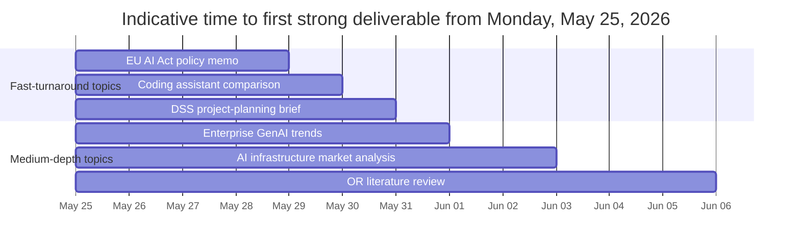
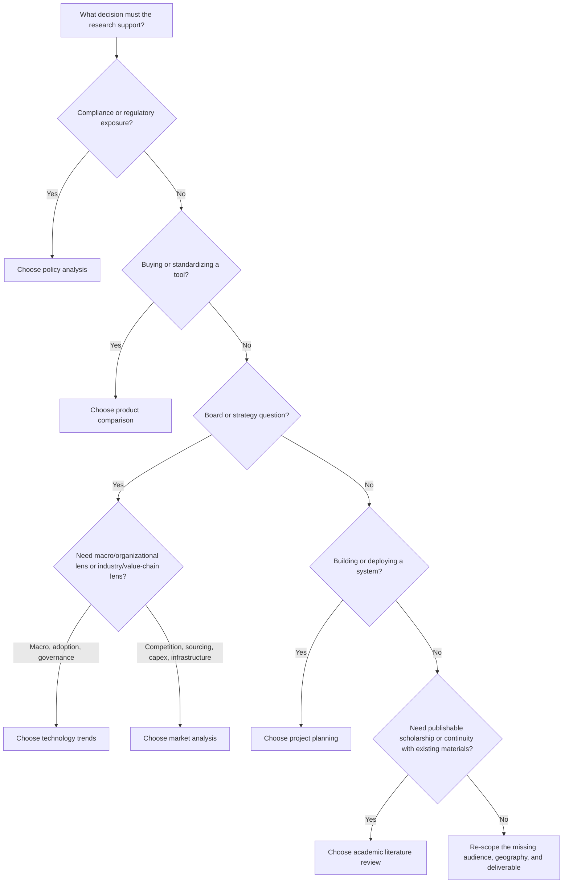

# Open-Ended Deep Research Topic Prioritization Report

## Executive Summary

The active request explicitly instructs that the subject be treated as missing, so this report treats **topic selection itself** as the research problem. At the same time, there is a meaningful contextual signal in the conversation: an uploaded note already defines a concrete academic literature-review problem on hierarchical stochastic production planning for a bubble-tea manufacturer. I therefore treat that note as a **context-sensitive override**, not as the binding topic for this report. fileciteturn0file0

Under open-ended constraints, the strongest **generic** starting points are, in order: **policy analysis** on EU AI Act implementation, **product comparison** of enterprise coding assistants, **technology-trend research** on enterprise generative AI adoption, **market analysis** of AI infrastructure and supply chains, **project planning** for an AI-enabled or optimization-based decision support system, and **academic literature review** for the already-scoped operations-research paper. The first two rank highest for most users because they support near-term compliance and spending decisions; the third and fourth are strongest for strategy and capital allocation; the fifth is best when execution matters more than interpretation; and the sixth should move to the top if continuity with existing materials matters. The urgency behind the policy topic is concrete: the EU AI Act applies from **August 2, 2026**, with some provisions already applicable from **February 2, 2025** and **August 2, 2025**. The product-comparison topic is also time-sensitive because official vendor documentation shows rapid platform and packaging changes across GitHub, Google, Anthropic, and OpenAI. citeturn8view3turn21view0turn25view0turn15view3turn16view0turn26view1

If the selection criterion is **compliance exposure**, choose policy analysis. If it is a **buy-or-standardize decision**, choose product comparison. If it is **board-level positioning**, choose technology trends or market analysis. If it is **implementation readiness**, choose project planning. If it is **paper writing, novelty framing, or continuity with the uploaded OR materials**, choose the academic literature review. citeturn22view3turn23view2turn11academia0turn12view1

## Missing Specifics and Working Assumptions

Because the topic was intentionally left unspecified, I made the following working assumptions.

| Missing specificity | Working assumption |
|---|---|
| Core subject | The task is to choose a research direction, not to execute full topic-specific research yet |
| Primary audience | A professional or researcher who needs a defensible topic choice and a practical starting plan |
| Geography | Global by default, except where a topic is naturally geography-bound; policy analysis is EU-centered because the deadlines are clear and near-term |
| Decision type | Unknown, so topics are prioritized by broad decision value: compliance, spending, strategy, implementation, and publication |
| Source perimeter | Prefer official regulation, vendor documentation, original papers, and primary institutional reports |
| Time horizon | Immediate 2026 relevance, with initial deliverables expected within days rather than months |
| Desired depth | Enough rigor to select one topic confidently, not a full dissertation-style treatment |
| Continuity with prior material | Optional override; the uploaded OR note suggests that continuity may matter and should influence the final choice if the goal is to continue existing work fileciteturn0file0 |

These assumptions also imply a methodological bias toward topics with **clear primary-source ecosystems**. That is why the policy, product, and technology topics rank ahead of more speculative or purely opinion-driven themes: they can be grounded immediately in official law, formal frameworks, original benchmark papers, and current vendor documentation. citeturn8view4turn21view2turn22view1turn23view1turn11academia0turn11academia2

## Prioritized Topic Portfolio

The ranking below balances five criteria: immediate decision leverage, timeliness, availability of primary sources, cross-audience usefulness, and continuity with material already present in the conversation. Where a topic is especially dependent on rapidly changing sources, I treat that as a reason to prioritize it rather than defer it. citeturn8view3turn23view0turn15view3turn26view0

### Policy Analysis on EU AI Act Implementation

**Description.** This is the strongest generic starting point because it is anchored in a binding legal text with staged applicability dates, and because it connects immediately to governance, procurement, product design, and risk management. The EU AI Act lays down harmonized rules, prohibited practices, obligations for high-risk systems, transparency rules, and governance mechanisms; its broad applicability begins on **August 2, 2026**, with some provisions already in force earlier. NIST’s AI RMF Playbook is a useful companion because it translates AI governance into actionable **Govern, Map, Measure, Manage** activities. citeturn8view4turn8view3turn21view0

**Key research questions.** Which current or planned AI use cases fall in scope; which obligations are already active versus imminent; how should organizational controls map from legal obligations to operational procedures; and what gaps exist across documentation, monitoring, incident response, procurement, and vendor management.

**Methodology.** Build a use-case inventory, classify systems by risk and role, map obligations article-by-article, and turn the result into a gap-assessment matrix. A strong version would crosswalk EU requirements against NIST RMF functions and then test the crosswalk against two or three concrete internal use cases.

**Likely authoritative sources to consult.** EUR-Lex for the regulation text; European Commission and AI Office guidance; NIST AI RMF and Playbook; sector regulator guidance; vendor trust, privacy, and security documentation.

**Expected deliverables.** A compliance obligations matrix, use-case classification sheet, governance gap register, and a prioritized remediation roadmap.

**Estimated timeline.** Three to five business days for an initial executive memo; seven to ten business days for a sector-specific deep report.

### Product Comparison of Enterprise Coding Assistants

**Description.** This topic is highly decision-useful because it supports immediate product selection and standardization, and because official documentation shows the space is changing quickly. GitHub documents enterprise policies, model comparison, guardrails, agentic activity monitoring, and audit controls; Anthropic describes Claude Code as an agentic tool that can read a codebase, edit files, run commands, and integrate with development tools across multiple surfaces; Google documents enterprise-grade security, private-repository customization, source citations, and an active product migration path; OpenAI describes Codex as a cloud-based software-engineering agent that works on many tasks in parallel in isolated sandboxed environments; and SWE-bench provides a neutral benchmark structure for external validation. citeturn25view0turn25view3turn16view0turn15view3turn26view0turn11academia0

**Key research questions.** Which tool fits the actual engineering workflow; how strong are enterprise controls; what level of repository awareness and agent autonomy is appropriate; how do products compare on explainability, logging, model choice, pricing, and operational risk; and how do official claims hold up against external benchmarks and a small internal pilot.

**Methodology.** Normalize product capabilities into a common scorecard, separate vendor claims from benchmark evidence, and run a structured pilot using a representative task set. The most defensible version of this comparison uses both public benchmarks such as SWE-bench and internal tasks that reflect the real codebase and governance environment.

**Likely authoritative sources to consult.** Official vendor docs, security and privacy pages, pricing pages, legal terms, changelogs, benchmark papers, and internal pilot telemetry.

**Expected deliverables.** A weighted comparison matrix, shortlist recommendation, risks-and-controls appendix, and a pilot design with acceptance criteria.

**Estimated timeline.** Four to six business days for a rigorous desk comparison; one to two weeks if a pilot is included.

### Technology Trends in Enterprise Generative AI Adoption

**Description.** This is the best “board memo” topic. Stanford HAI’s AI Index explicitly positions itself as a broadly sourced, rigorously vetted resource for policymakers, researchers, executives, journalists, and the public, with 2025 coverage spanning policy and technical developments. The IEA’s *Energy and AI* report adds an important constraint: widespread AI deployment is increasingly an infrastructure and electricity question, not just a software question. Together they support a trend report that is strategic rather than hype-driven. citeturn22view3turn23view0

**Key research questions.** Which enterprise AI trends are durable rather than cyclical; where are the true bottlenecks, such as evaluation, data, compute, electricity, and governance; which functions are being restructured first; and what indicators separate tactical experimentation from scalable adoption.

**Methodology.** Synthesize official and quasi-official datasets, cluster use cases by business function, compare strategic scenarios, and distinguish capability trends from operational readiness trends. A good version of this report should include a “signal versus noise” framework rather than just a list of headlines.

**Likely authoritative sources to consult.** Stanford HAI AI Index; IEA; NIST; OECD and IMF publications where relevant; major vendor annual reports and enterprise case studies.

**Expected deliverables.** A trend map, scenario analysis, executive brief, and a list of monitoring indicators for quarterly updates.

**Estimated timeline.** Five to seven business days.

### Market Analysis of AI Infrastructure and Supply Chains

**Description.** This topic is best when the user’s underlying decision is capital allocation, sourcing, competitive positioning, or industrial exposure. The IEA’s framing is especially useful because it directly links AI deployment to electricity demand, energy supply, emissions, and affordability; the AI Index adds trend-tracking around the broader AI ecosystem. That makes this market-analysis topic less speculative than many “AI market” reports and more grounded in primary evidence. citeturn23view1turn22view3

**Key research questions.** Where are the binding constraints in the value chain: chips, advanced packaging, networking, memory, power, siting, cooling, permitting, or grid capacity; which firms capture value versus absorb cost; and which dependencies create the greatest geopolitical or operational risk.

**Methodology.** Build a value-chain map, identify concentration points, use company filings and earnings materials to quantify exposure, and stress-test the market against power, regulation, and supply bottlenecks.

**Likely authoritative sources to consult.** IEA; annual reports and regulatory filings from semiconductor, equipment, and hyperscaler firms; official trade and export-control notices; energy-system reports.

**Expected deliverables.** A market map, firm landscape, dependency matrix, and risk-adjusted scenario analysis.

**Estimated timeline.** Seven to ten business days.

### Project Planning for an AI-Enabled or Optimization-Based Decision Support System

**Description.** This is the best choice when the real need is not just “understanding” but **building**. NIST’s AI RMF Playbook is valuable here because it is explicitly designed for trustworthiness considerations in the design, development, deployment, and use of AI systems, and because it offers practical actions under Govern, Map, Measure, and Manage. Current vendor docs also show that agentic systems now require explicit design choices around permissions, context, hooks, task isolation, monitoring, and auditability. citeturn21view0turn25view0turn16view0turn26view0

**Key research questions.** What is the minimum viable use case; what data and integration dependencies exist; what decision rights and human approvals are needed; what KPIs define success; what risks require guardrails before launch; and whether the right answer is build, buy, or hybrid.

**Methodology.** Conduct process mapping, stakeholder interviews, architecture option analysis, risk-register design, and phased pilot planning. For a stronger plan, include a benefits-realization model and governance RACI.

**Likely authoritative sources to consult.** Internal SOPs and architecture docs; NIST AI RMF; vendor security and implementation documentation; procurement constraints; existing BI, ERP, or engineering workflows.

**Expected deliverables.** A phased roadmap, RACI chart, KPI set, pilot charter, and change-management plan.

**Estimated timeline.** Five to eight business days for the plan itself.

### Academic Literature Review on Hierarchical Stochastic Production Planning

**Description.** This is the highest-continuity option, even though it is not the strongest generic topic. The uploaded note already frames a publishable literature problem around a hierarchical stochastic production planning paper, including rolling-horizon planning, a two-stage stochastic aggregate model, daily scheduling, multi-level BOM structure, food-manufacturing case relevance, and VSS-oriented evidence claims. It also names specific candidate references and verification questions. The methodological advantage is that the problem statement is already sharply structured; the methodological requirement is that the review be protocol-driven and evidence-table based. Cochrane’s current handbook is useful here not for medical content, but for disciplined review mechanics: scoping, inclusion criteria, searching, extraction, and synthesis. fileciteturn0file0 citeturn12view1

**Key research questions.** The precise questions already exist in the uploaded note: canonical rolling-horizon references; stochastic MLCLSP papers; real food and beverage case studies; exact matches or close analogs for two-stage stochastic plus rolling-horizon architectures; verification or replacement of weak citations; and applied VSS examples in production-planning contexts. fileciteturn0file0

**Methodology.** Run a protocol-driven search in Scopus, Web of Science, and Google Scholar; verify each citation directly from publisher or official bibliographic records; use backward and forward citation chaining; and structure evidence by model class, uncertainty treatment, industry, and computational evidence.

**Likely authoritative sources to consult.** Original papers in top OR/MS and production journals, publisher pages, Google Scholar for citation rough-ordering, Scopus/Web of Science for metadata, and textbooks or handbooks for canonical framing.

**Expected deliverables.** An annotated citation matrix, novelty and gap map, canonical-reference shortlist, and a draft literature-review section.

**Estimated timeline.** Seven to twelve business days, depending largely on database access and citation verification needs.

## Comparative View

The table below synthesizes the topic portfolio into a selection-friendly format. Its source ecosystems are grounded primarily in EUR-Lex, NIST, Stanford HAI, the IEA, Cochrane, original benchmark papers, current vendor documentation, and the uploaded OR note already present in the conversation. citeturn8view3turn21view0turn22view3turn23view2turn12view1turn11academia0turn16view0turn15view3turn26view0 fileciteturn0file0

| Priority under generic uncertainty | Topic | Scope | Best audience | Depth | Time to initial deliverable | Recommended primary source base |
|---|---|---|---|---|---|---|
| Highest | EU AI Act policy analysis | Medium, regulation-centered | Legal, governance, product, procurement leaders | Medium to high | 3–5 business days | EUR-Lex, EU guidance, NIST AI RMF |
| High | Enterprise coding-assistant comparison | Medium, decision-specific | Engineering leaders, platform teams, procurement | Medium | 4–6 business days | Official vendor docs, benchmark papers, pilot evidence |
| High | Enterprise GenAI technology trends | Broad, strategy-centered | Executives, strategy teams, innovation leads | Medium | 5–7 business days | Stanford HAI, IEA, NIST, institutional reports |
| Medium | AI infrastructure market analysis | Medium to broad | Strategy, finance, industrial, sourcing teams | High | 7–10 business days | IEA, company filings, official notices |
| Medium | DSS project planning | Medium, implementation-centered | PMO, IT, operations, transformation leads | Medium to high | 5–8 business days | Internal docs, NIST, vendor implementation material |
| Conditional first if continuity matters | Academic OR literature review | Narrow but deep | Researchers, students, paper authors | High | 7–12 business days | Original papers, citation databases, publisher pages, uploaded note |

If the decision criterion is **continuity with work already underway**, the academic OR topic should be promoted from “conditional” to **first choice**, because the note already contains the problem framing, contribution logic, and literature targets. fileciteturn0file0

The timeline above estimates time to a **first defensible research deliverable**, not full implementation, stakeholder sign-off, or journal-quality writing.

## Decision Criteria and Next Steps

The fastest way to choose correctly is to anchor the topic to the **decision it must support**. If the decision is external-compliance sensitive, the policy topic dominates. If money will be spent on a tool within the next month, the product-comparison topic dominates. If leadership needs a forward-looking narrative, choose technology trends or market analysis depending on whether the emphasis is organizational transformation or industrial structure. If the goal is to execute a pilot or deployment, choose project planning. If the goal is to publish, position novelty, or continue existing research work, choose the academic literature review, especially because a substantial OR research scaffold already exists in the uploaded note. citeturn8view3turn22view3turn23view0turn25view0 fileciteturn0file0

### Suggested Next Steps

1. **Lock the governing question.** Choose one of five decision modes: compliance, purchase, strategy, implementation, or publication.  
2. **Freeze three context variables.** Specify the audience, geography, and intended output artifact. Those three choices determine source selection more than topic labels do.  
3. **Adopt the matching source perimeter.** Use law and standards for policy; vendor docs plus benchmarks for product comparison; institutional reports plus filings for trends and markets; original papers plus citation databases for academic review; internal process material plus governance frameworks for project planning.  
4. **Start with a one-page issue tree.** Before deeper research, define the top-level questions, exclusions, and decision criteria for the chosen topic.  
5. **Use the uploaded OR note only if continuity matters.** If the real objective is to continue that paper, do not spend time on generic topic selection; go directly into citation verification, novelty mapping, and gap analysis around the already-scoped operations-research question. fileciteturn0file0